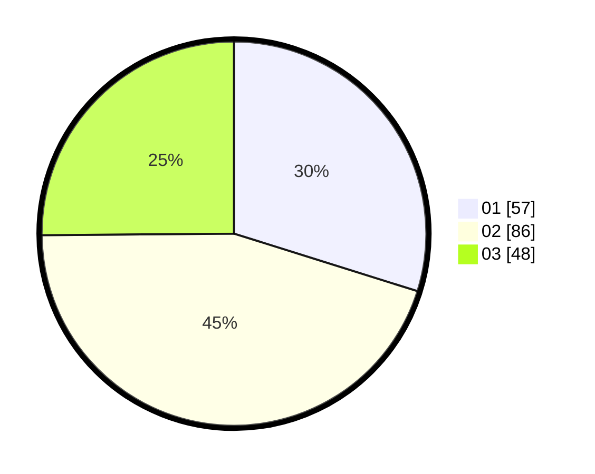

# Hasil

Hasil perolehan suara paslon dapat dilihat pada file paslon-01.txt, paslon-02.txt, dan paslon-03.txt.

Jika tidak ada, artinya data tersebut belum ada pada SIREKAP.

## Perolehan Suara

 * Paslon 01: **57**.
 * Paslon 02: **86**.
 * Paslon 03: **48**.

## Foto C Plano

https://sirekap-obj-formc.kpu.go.id/a704/pemilu/ppwp/31/71/06/10/02/3171061002024-20240217-204455--b2a3e400-1f1c-457e-a470-2aeea3b84090.jpg

https://sirekap-obj-formc.kpu.go.id/a704/pemilu/ppwp/31/71/06/10/02/3171061002024-20240217-204540--36e09bfb-9f41-440b-8ac6-9438b39bea6e.jpg

https://sirekap-obj-formc.kpu.go.id/a704/pemilu/ppwp/31/71/06/10/02/3171061002024-20240217-205543--4bd412c8-a7cf-4b92-9e38-ab2a3ce5a5c9.jpg

## DATA PEMILIH TETAP

Jumlah pemilih dalam DPT: **223**.
 * L: **104**.
 * P: **119**.

## DATA PENGGUNA HAK PILIH

Jumlah pengguna hak pilih dalam DPT: **162**.
 * L: **89**.
 * P: **73**.

Jumlah pengguna hak pilih dalam DPTb: **30**.
 * L: **14**.
 * P: **16**.

Jumlah pengguna hak pilih dalam DPK: **2**.
 * L: **2**.
 * P: **0**.

Jumlah pengguna hak pilih: **194**.
 * L: **105**.
 * P: **89**.

## JUMLAH SUARA SAH DAN TIDAK SAH

JUMLAH SELURUH SUARA SAH: **191**.

JUMLAH SUARA TIDAK SAH: **3**.

JUMLAH SELURUH SUARA SAH DAN SUARA TIDAK SAH: **194**.
