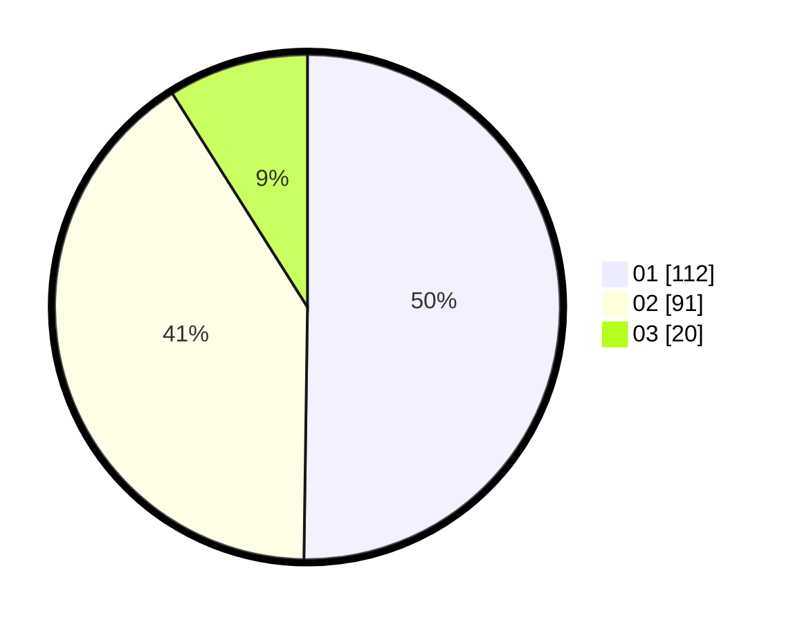

# Hasil

Hasil perolehan suara paslon dapat dilihat pada file paslon-01.txt, paslon-02.txt, dan paslon-03.txt.

Jika tidak ada, artinya data tersebut belum ada pada SIREKAP.

## Perolehan Suara

 * Paslon 01: **112**.
 * Paslon 02: **91**.
 * Paslon 03: **20**.

## Foto C Plano

https://sirekap-obj-formc.kpu.go.id/2f6f/pemilu/ppwp/31/71/06/10/02/3171061002025-20240216-223232--0c2c5749-6579-48fb-aa1b-d70f3bf007fb.jpg

https://sirekap-obj-formc.kpu.go.id/2f6f/pemilu/ppwp/31/71/06/10/02/3171061002025-20240216-223429--9a5a40ef-c93f-4090-abe9-679506b4bc20.jpg
