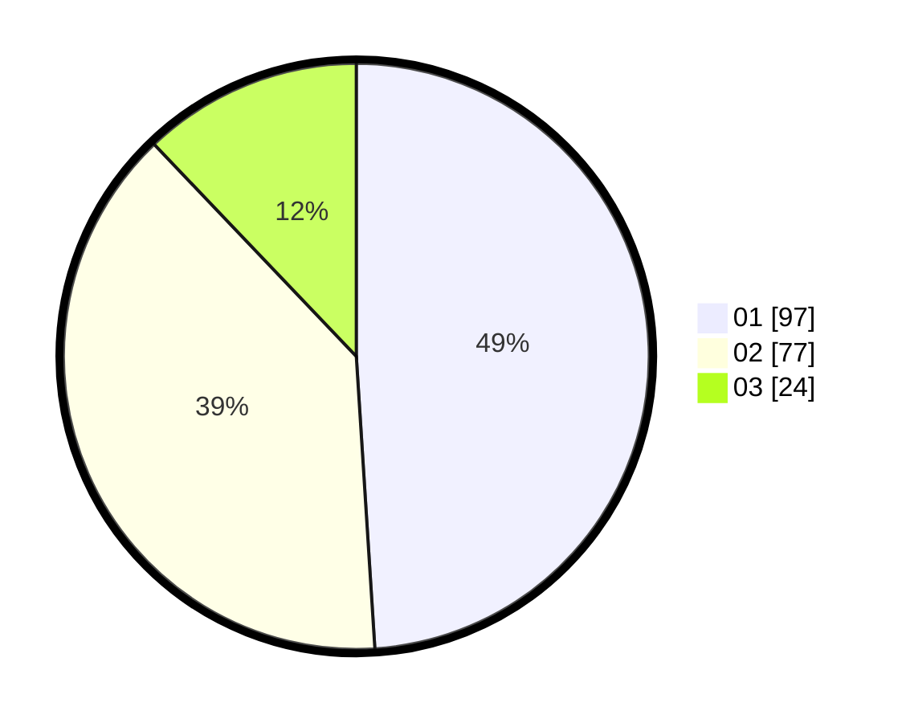

# Hasil

Hasil perolehan suara paslon dapat dilihat pada file paslon-01.txt, paslon-02.txt, dan paslon-03.txt.

Jika tidak ada, artinya data tersebut belum ada pada SIREKAP.

## Perolehan Suara

 * Paslon 01: **97**.
 * Paslon 02: **77**.
 * Paslon 03: **24**.

## Foto C Plano

https://sirekap-obj-formc.kpu.go.id/eee2/pemilu/ppwp/31/71/06/10/02/3171061002026-20240216-220136--9ae70f9c-e986-480d-947e-1206ad882547.jpg

https://sirekap-obj-formc.kpu.go.id/eee2/pemilu/ppwp/31/71/06/10/02/3171061002026-20240217-203205--5d959089-c01d-4bd7-ac90-bec1166bf371.jpg

https://sirekap-obj-formc.kpu.go.id/eee2/pemilu/ppwp/31/71/06/10/02/3171061002026-20240217-202637--4eb6c98e-c896-40ed-8fa2-6a43f0d5532f.jpg

## DATA PEMILIH TETAP

Jumlah pemilih dalam DPT: **242**.
 * L: **120**.
 * P: **122**.

## DATA PENGGUNA HAK PILIH

Jumlah pengguna hak pilih dalam DPT: **195**.
 * L: **96**.
 * P: **99**.

Jumlah pengguna hak pilih dalam DPTb: **2**.
 * L: **1**.
 * P: **1**.

Jumlah pengguna hak pilih dalam DPK: **2**.
 * L: **2**.
 * P: **0**.

Jumlah pengguna hak pilih: **199**.
 * L: **99**.
 * P: **100**.

## JUMLAH SUARA SAH DAN TIDAK SAH

JUMLAH SELURUH SUARA SAH: **198**.

JUMLAH SUARA TIDAK SAH: **1**.

JUMLAH SELURUH SUARA SAH DAN SUARA TIDAK SAH: **199**.
