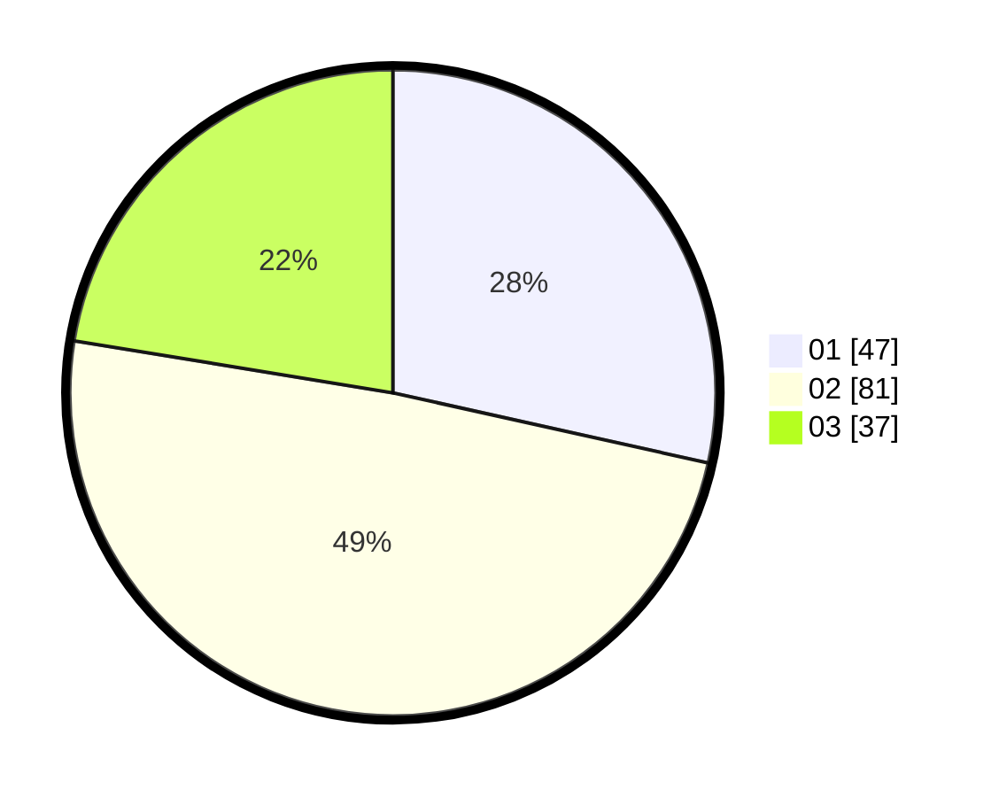

# Hasil

Hasil perolehan suara paslon dapat dilihat pada file paslon-01.txt, paslon-02.txt, dan paslon-03.txt.

Jika tidak ada, artinya data tersebut belum ada pada SIREKAP.

## Perolehan Suara

 * Paslon 01: **47**.
 * Paslon 02: **81**.
 * Paslon 03: **37**.

## Foto C Plano

https://sirekap-obj-formc.kpu.go.id/0e41/pemilu/ppwp/31/71/06/10/02/3171061002033-20240218-151819--fbea85ee-dcd6-4354-a25c-62c8784dd329.jpg

https://sirekap-obj-formc.kpu.go.id/0e41/pemilu/ppwp/31/71/06/10/02/3171061002033-20240218-152104--fd5efd56-5654-4fb8-9ef3-1c46d94debef.jpg

https://sirekap-obj-formc.kpu.go.id/0e41/pemilu/ppwp/31/71/06/10/02/3171061002033-20240218-152213--6c830aa9-8581-452f-84aa-149312767c74.jpg

## DATA PEMILIH TETAP

Jumlah pemilih dalam DPT: **184**.
 * L: **75**.
 * P: **109**.

## DATA PENGGUNA HAK PILIH

Jumlah pengguna hak pilih dalam DPT: **144**.
 * L: **61**.
 * P: **83**.

Jumlah pengguna hak pilih dalam DPTb: **7**.
 * L: **3**.
 * P: **4**.

Jumlah pengguna hak pilih dalam DPK: **16**.
 * L: **6**.
 * P: **10**.

Jumlah pengguna hak pilih: **167**.
 * L: **70**.
 * P: **97**.

## JUMLAH SUARA SAH DAN TIDAK SAH

JUMLAH SELURUH SUARA SAH: **165**.

JUMLAH SUARA TIDAK SAH: **2**.

JUMLAH SELURUH SUARA SAH DAN SUARA TIDAK SAH: **167**.
