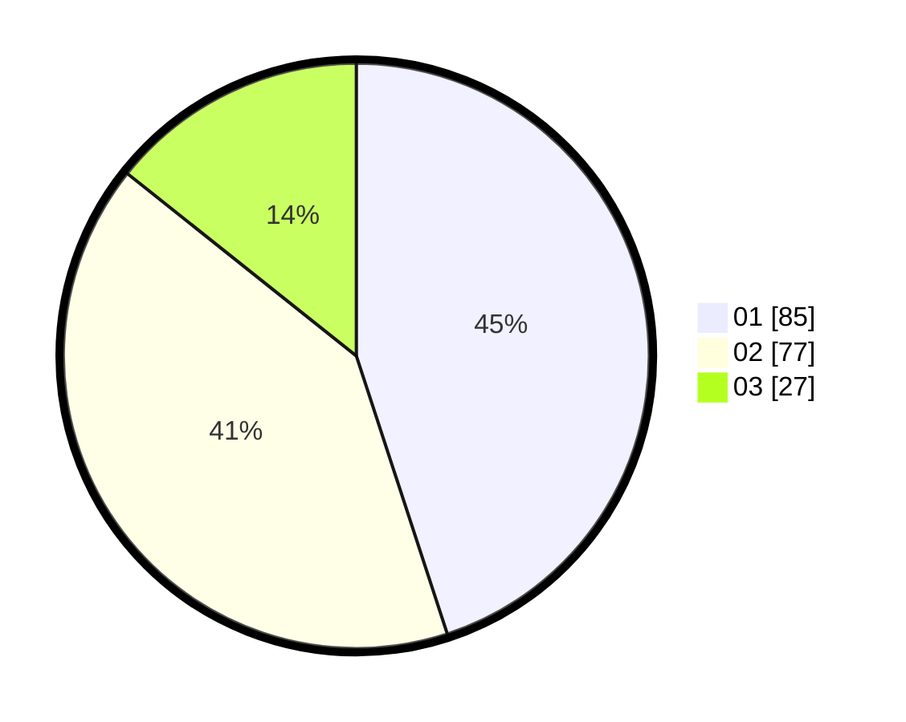

# Hasil

Hasil perolehan suara paslon dapat dilihat pada file paslon-01.txt, paslon-02.txt, dan paslon-03.txt.

Jika tidak ada, artinya data tersebut belum ada pada SIREKAP.

## Perolehan Suara

 * Paslon 01: **85**.
 * Paslon 02: **77**.
 * Paslon 03: **27**.

## Foto C Plano

https://sirekap-obj-formc.kpu.go.id/74be/pemilu/ppwp/31/71/06/10/02/3171061002034-20240214-155537--af8fcf27-07c9-4233-8315-830dd8b7567c.jpg

https://sirekap-obj-formc.kpu.go.id/74be/pemilu/ppwp/31/71/06/10/02/3171061002034-20240214-155544--73d59aeb-3a4e-4335-af57-42562c743b7f.jpg

https://sirekap-obj-formc.kpu.go.id/74be/pemilu/ppwp/31/71/06/10/02/3171061002034-20240214-155548--29cd7e47-a8b5-45e9-9378-35e8ca79c30a.jpg

## DATA PEMILIH TETAP

Jumlah pemilih dalam DPT: **251**.
 * L: **124**.
 * P: **127**.

## DATA PENGGUNA HAK PILIH

Jumlah pengguna hak pilih dalam DPT: **191**.
 * L: **94**.
 * P: **97**.

Jumlah pengguna hak pilih dalam DPTb: **2**.
 * L: **1**.
 * P: **1**.

Jumlah pengguna hak pilih dalam DPK: **0**.
 * L: **0**.
 * P: **0**.

Jumlah pengguna hak pilih: **193**.
 * L: **95**.
 * P: **98**.

## JUMLAH SUARA SAH DAN TIDAK SAH

JUMLAH SELURUH SUARA SAH: **189**.

JUMLAH SUARA TIDAK SAH: **4**.

JUMLAH SELURUH SUARA SAH DAN SUARA TIDAK SAH: **193**.
