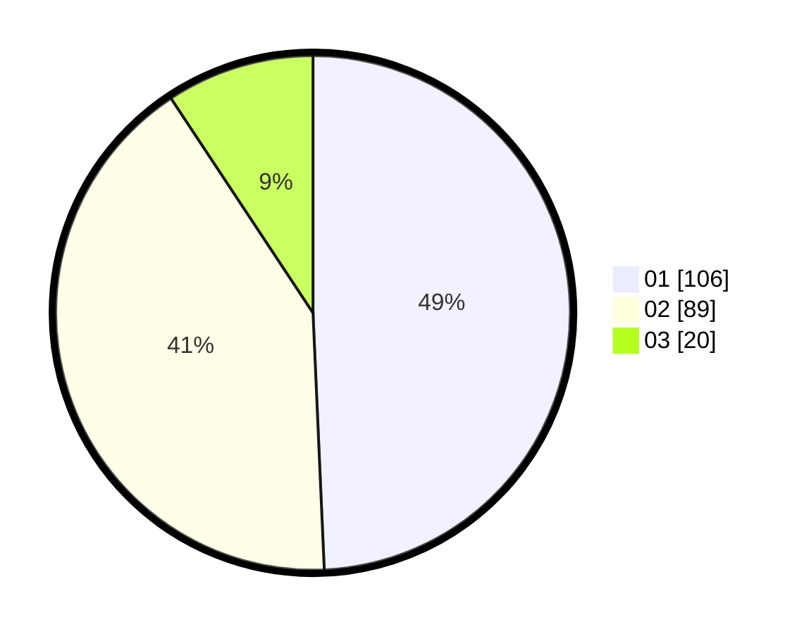

# Hasil

Hasil perolehan suara paslon dapat dilihat pada file paslon-01.txt, paslon-02.txt, dan paslon-03.txt.

Jika tidak ada, artinya data tersebut belum ada pada SIREKAP.

## Perolehan Suara

 * Paslon 01: **106**.
 * Paslon 02: **89**.
 * Paslon 03: **20**.

## Foto C Plano

https://sirekap-obj-formc.kpu.go.id/e88e/pemilu/ppwp/31/71/06/10/02/3171061002035-20240214-223752--39d1eda6-af34-47fe-a405-192dfb3a3bdb.jpg

https://sirekap-obj-formc.kpu.go.id/e88e/pemilu/ppwp/31/71/06/10/02/3171061002035-20240214-223934--9f7b813b-b8bf-48a1-85d0-09f4e129cd37.jpg

https://sirekap-obj-formc.kpu.go.id/e88e/pemilu/ppwp/31/71/06/10/02/3171061002035-20240214-223602--269f9c46-5797-410f-8b4f-9d3585b43e91.jpg

## DATA PEMILIH TETAP

Jumlah pemilih dalam DPT: **274**.
 * L: **177**.
 * P: **137**.

## DATA PENGGUNA HAK PILIH

Jumlah pengguna hak pilih dalam DPT: **219**.
 * L: **105**.
 * P: **114**.

Jumlah pengguna hak pilih dalam DPTb: **1**.
 * L: **0**.
 * P: **1**.

Jumlah pengguna hak pilih dalam DPK: **5**.
 * L: **4**.
 * P: **1**.

Jumlah pengguna hak pilih: **229**.
 * L: **109**.
 * P: **116**.

## JUMLAH SUARA SAH DAN TIDAK SAH

JUMLAH SELURUH SUARA SAH: **215**.

JUMLAH SUARA TIDAK SAH: **10**.

JUMLAH SELURUH SUARA SAH DAN SUARA TIDAK SAH: **225**.
