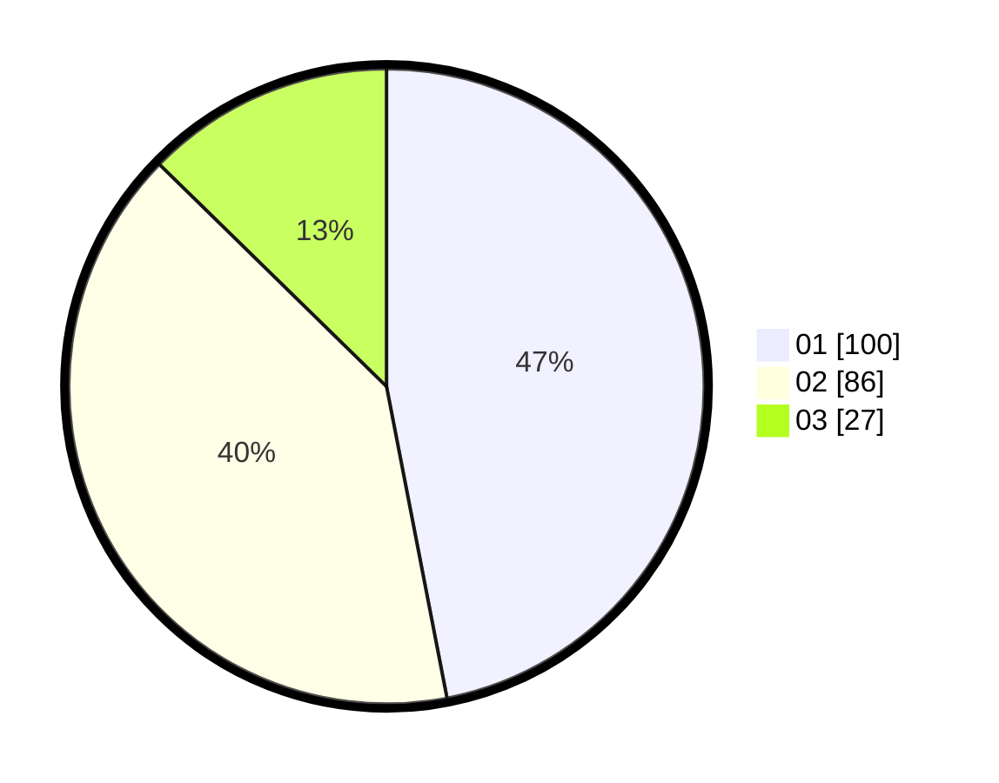

# Hasil

Hasil perolehan suara paslon dapat dilihat pada file paslon-01.txt, paslon-02.txt, dan paslon-03.txt.

Jika tidak ada, artinya data tersebut belum ada pada SIREKAP.

## Perolehan Suara

 * Paslon 01: **100**.
 * Paslon 02: **86**.
 * Paslon 03: **27**.

## Foto C Plano

https://sirekap-obj-formc.kpu.go.id/7591/pemilu/ppwp/31/71/06/10/02/3171061002036-20240214-210739--b084def8-58d0-4a08-8dae-18bc473cb1ed.jpg

https://sirekap-obj-formc.kpu.go.id/7591/pemilu/ppwp/31/71/06/10/02/3171061002036-20240215-001330--ac83c951-0a7f-48d8-820d-123f3febaef2.jpg

https://sirekap-obj-formc.kpu.go.id/7591/pemilu/ppwp/31/71/06/10/02/3171061002036-20240214-212209--92bd052b-58c0-4fc0-858a-caebcceea12d.jpg

## DATA PEMILIH TETAP

Jumlah pemilih dalam DPT: **262**.
 * L: **139**.
 * P: **123**.

## DATA PENGGUNA HAK PILIH

Jumlah pengguna hak pilih dalam DPT: **262**.
 * L: **139**.
 * P: **123**.

Jumlah pengguna hak pilih dalam DPTb: **0**.
 * L: **0**.
 * P: **0**.

Jumlah pengguna hak pilih dalam DPK: **0**.
 * L: **0**.
 * P: **0**.

Jumlah pengguna hak pilih: **262**.
 * L: **139**.
 * P: **123**.

## JUMLAH SUARA SAH DAN TIDAK SAH

JUMLAH SELURUH SUARA SAH: **213**.

JUMLAH SUARA TIDAK SAH: **2**.

JUMLAH SELURUH SUARA SAH DAN SUARA TIDAK SAH: **215**.
