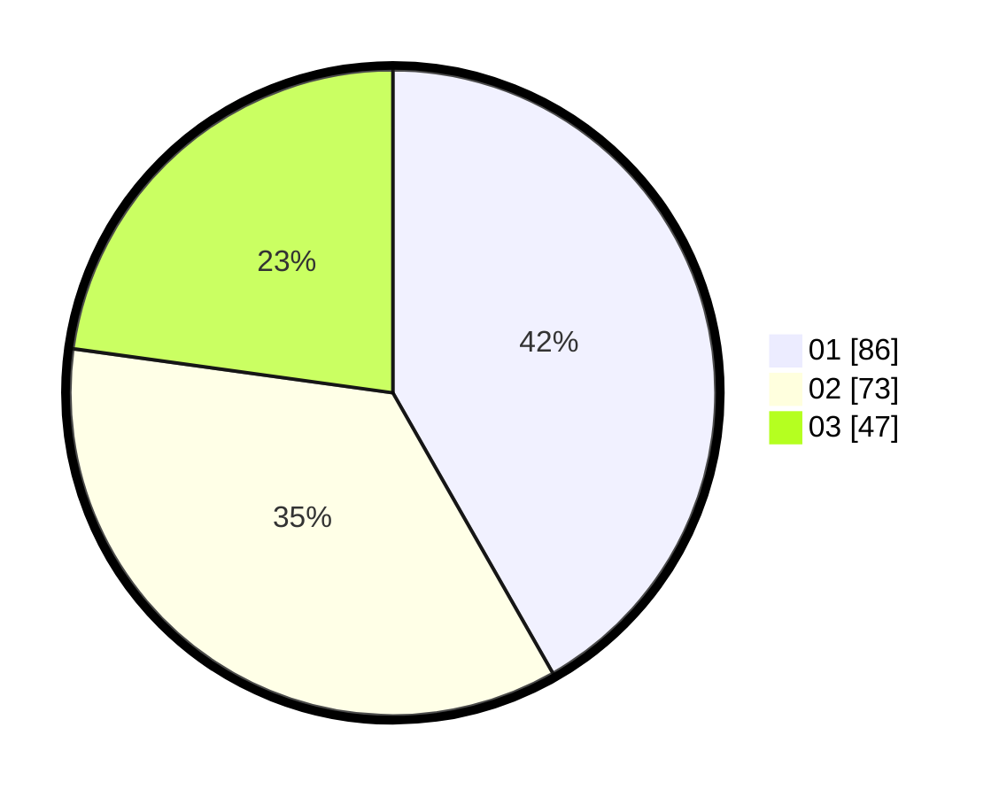

# Hasil

Hasil perolehan suara paslon dapat dilihat pada file paslon-01.txt, paslon-02.txt, dan paslon-03.txt.

Jika tidak ada, artinya data tersebut belum ada pada SIREKAP.

## Perolehan Suara

 * Paslon 01: **86**.
 * Paslon 02: **73**.
 * Paslon 03: **47**.

## Foto C Plano

https://sirekap-obj-formc.kpu.go.id/74ce/pemilu/ppwp/31/71/06/10/02/3171061002053-20240218-122252--d7e25862-ae31-4d4c-960b-15e129b4e9d2.jpg

https://sirekap-obj-formc.kpu.go.id/74ce/pemilu/ppwp/31/71/06/10/02/3171061002053-20240218-135237--5441b09e-4998-4c2a-a218-422811108a2d.jpg

https://sirekap-obj-formc.kpu.go.id/74ce/pemilu/ppwp/31/71/06/10/02/3171061002053-20240218-123019--a11b115f-7284-41a4-9318-0b776d6988f0.jpg

## DATA PEMILIH TETAP

Jumlah pemilih dalam DPT: **211**.
 * L: **104**.
 * P: **107**.

## DATA PENGGUNA HAK PILIH

Jumlah pengguna hak pilih dalam DPT: **211**.
 * L: **104**.
 * P: **107**.

Jumlah pengguna hak pilih dalam DPTb: **1**.
 * L: **0**.
 * P: **1**.

Jumlah pengguna hak pilih dalam DPK: **0**.
 * L: **0**.
 * P: **0**.

Jumlah pengguna hak pilih: **212**.
 * L: **104**.
 * P: **108**.

## JUMLAH SUARA SAH DAN TIDAK SAH

JUMLAH SELURUH SUARA SAH: **206**.

JUMLAH SUARA TIDAK SAH: **6**.

JUMLAH SELURUH SUARA SAH DAN SUARA TIDAK SAH: **212**.
