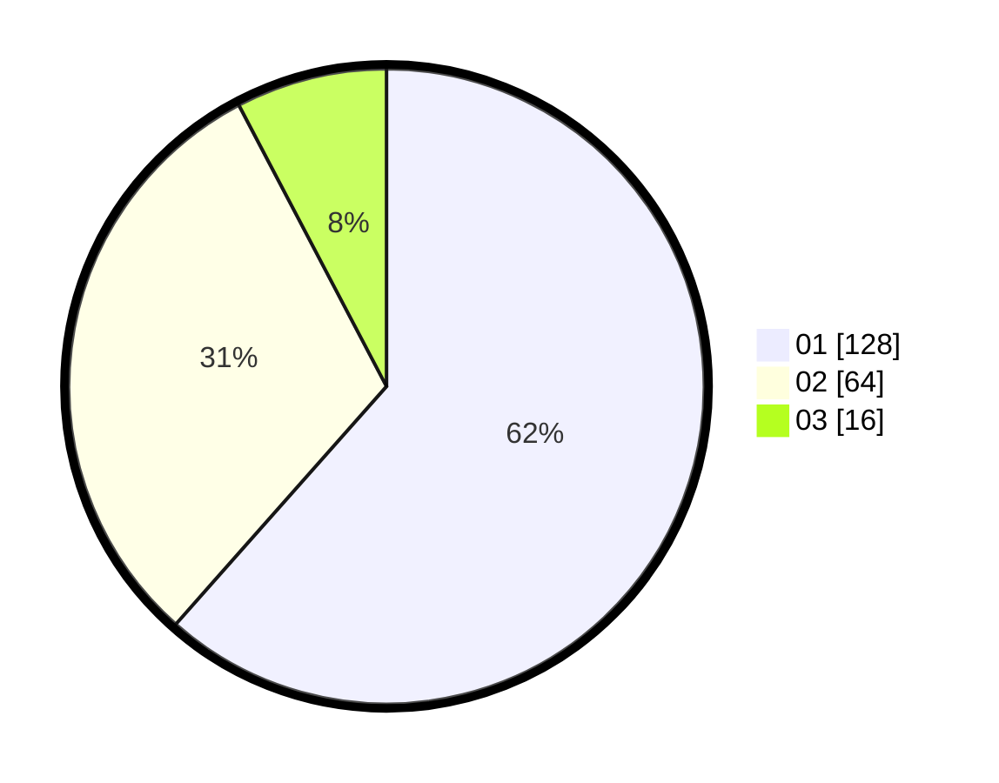

# Hasil

Hasil perolehan suara paslon dapat dilihat pada file paslon-01.txt, paslon-02.txt, dan paslon-03.txt.

Jika tidak ada, artinya data tersebut belum ada pada SIREKAP.

## Perolehan Suara

 * Paslon 01: **128**.
 * Paslon 02: **64**.
 * Paslon 03: **16**.

## Foto C Plano

https://sirekap-obj-formc.kpu.go.id/d873/pemilu/ppwp/31/71/06/10/02/3171061002054-20240214-203722--3e33f802-b8f1-46c0-9fde-77110b055673.jpg

https://sirekap-obj-formc.kpu.go.id/d873/pemilu/ppwp/31/71/06/10/02/3171061002054-20240214-203833--29a2ca19-e207-46e7-b1e1-24228fa2006b.jpg

https://sirekap-obj-formc.kpu.go.id/d873/pemilu/ppwp/31/71/06/10/02/3171061002054-20240214-203927--e923cbbe-97ef-498e-9539-90c86e0d5999.jpg

## DATA PEMILIH TETAP

Jumlah pemilih dalam DPT: **274**.
 * L: **137**.
 * P: **137**.

## DATA PENGGUNA HAK PILIH

Jumlah pengguna hak pilih dalam DPT: **206**.
 * L: **106**.
 * P: **100**.

Jumlah pengguna hak pilih dalam DPTb: **4**.
 * L: **3**.
 * P: **1**.

Jumlah pengguna hak pilih dalam DPK: **2**.
 * L: **1**.
 * P: **1**.

Jumlah pengguna hak pilih: **212**.
 * L: **110**.
 * P: **102**.

## JUMLAH SUARA SAH DAN TIDAK SAH

JUMLAH SELURUH SUARA SAH: **208**.

JUMLAH SUARA TIDAK SAH: **4**.

JUMLAH SELURUH SUARA SAH DAN SUARA TIDAK SAH: **212**.
