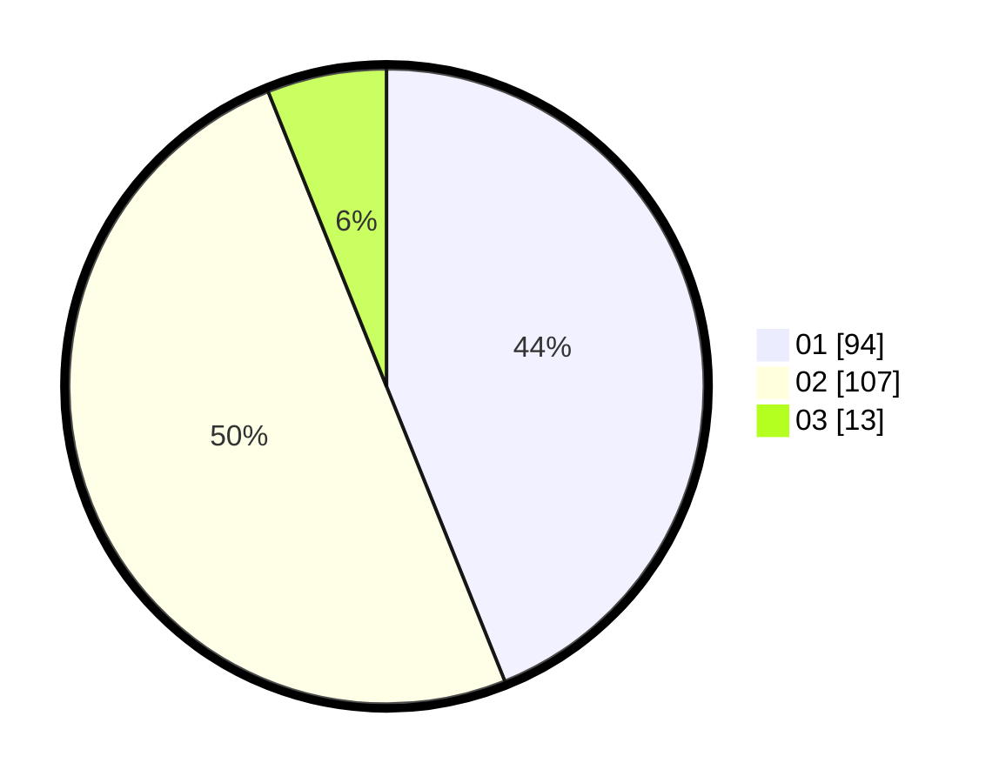

# Hasil

Hasil perolehan suara paslon dapat dilihat pada file paslon-01.txt, paslon-02.txt, dan paslon-03.txt.

Jika tidak ada, artinya data tersebut belum ada pada SIREKAP.

## Perolehan Suara

 * Paslon 01: **94**.
 * Paslon 02: **107**.
 * Paslon 03: **13**.

## Foto C Plano

https://sirekap-obj-formc.kpu.go.id/c5ad/pemilu/ppwp/31/71/06/10/02/3171061002062-20240215-021702--3d712b33-ba44-4105-ab7c-1be7452eda65.jpg

https://sirekap-obj-formc.kpu.go.id/c5ad/pemilu/ppwp/31/71/06/10/02/3171061002062-20240215-021711--8329b008-43da-42f0-b42a-3c721725f081.jpg

https://sirekap-obj-formc.kpu.go.id/c5ad/pemilu/ppwp/31/71/06/10/02/3171061002062-20240215-021717--8a2c7b28-e2d8-41d0-987a-df9c72d7cbfb.jpg

## DATA PEMILIH TETAP

Jumlah pemilih dalam DPT: **279**.
 * L: **143**.
 * P: **136**.

## DATA PENGGUNA HAK PILIH

Jumlah pengguna hak pilih dalam DPT: **220**.
 * L: **115**.
 * P: **105**.

Jumlah pengguna hak pilih dalam DPTb: **0**.
 * L: **0**.
 * P: **0**.

Jumlah pengguna hak pilih dalam DPK: **0**.
 * L: **0**.
 * P: **0**.

Jumlah pengguna hak pilih: **220**.
 * L: **115**.
 * P: **105**.

## JUMLAH SUARA SAH DAN TIDAK SAH

JUMLAH SELURUH SUARA SAH: **214**.

JUMLAH SUARA TIDAK SAH: **6**.

JUMLAH SELURUH SUARA SAH DAN SUARA TIDAK SAH: **220**.
