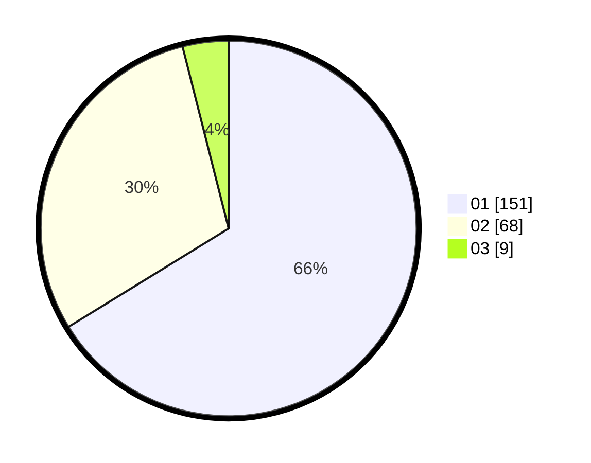

# Hasil

Hasil perolehan suara paslon dapat dilihat pada file paslon-01.txt, paslon-02.txt, dan paslon-03.txt.

Jika tidak ada, artinya data tersebut belum ada pada SIREKAP.

## Perolehan Suara

 * Paslon 01: **151**.
 * Paslon 02: **68**.
 * Paslon 03: **9**.

## Foto C Plano

https://sirekap-obj-formc.kpu.go.id/2f2c/pemilu/ppwp/31/71/06/10/02/3171061002068-20240214-160054--47b997e5-a884-4b7e-9be8-219235588e1a.jpg

https://sirekap-obj-formc.kpu.go.id/2f2c/pemilu/ppwp/31/71/06/10/02/3171061002068-20240214-160154--30ab7ccd-8745-46c0-b90f-2f0d7eb3ff22.jpg

https://sirekap-obj-formc.kpu.go.id/2f2c/pemilu/ppwp/31/71/06/10/02/3171061002068-20240214-194811--a7a7072f-a5b5-49cf-b105-266986a2b85a.jpg

## DATA PEMILIH TETAP

Jumlah pemilih dalam DPT: **277**.
 * L: **134**.
 * P: **143**.

## DATA PENGGUNA HAK PILIH

Jumlah pengguna hak pilih dalam DPT: **234**.
 * L: **111**.
 * P: **123**.

Jumlah pengguna hak pilih dalam DPTb: **0**.
 * L: **0**.
 * P: **0**.

Jumlah pengguna hak pilih dalam DPK: **1**.
 * L: **0**.
 * P: **1**.

Jumlah pengguna hak pilih: **235**.
 * L: **111**.
 * P: **124**.

## JUMLAH SUARA SAH DAN TIDAK SAH

JUMLAH SELURUH SUARA SAH: **228**.

JUMLAH SUARA TIDAK SAH: **7**.

JUMLAH SELURUH SUARA SAH DAN SUARA TIDAK SAH: **235**.
