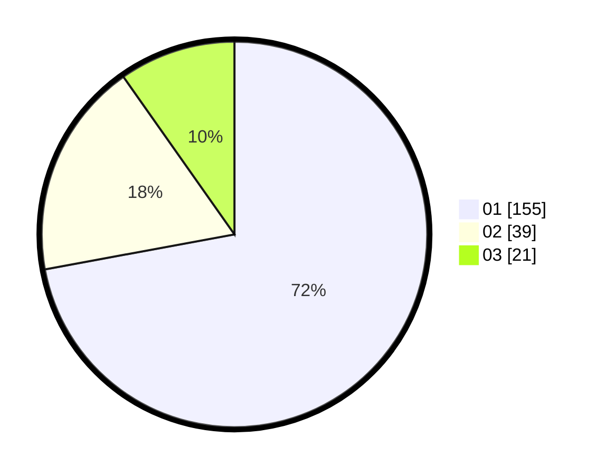

# Hasil

Hasil perolehan suara paslon dapat dilihat pada file paslon-01.txt, paslon-02.txt, dan paslon-03.txt.

Jika tidak ada, artinya data tersebut belum ada pada SIREKAP.

## Perolehan Suara

 * Paslon 01: **155**.
 * Paslon 02: **39**.
 * Paslon 03: **21**.

## Foto C Plano

https://sirekap-obj-formc.kpu.go.id/51cb/pemilu/ppwp/31/71/06/10/02/3171061002070-20240214-155051--c2537742-ac59-4928-be12-22a0fc37277e.jpg

https://sirekap-obj-formc.kpu.go.id/51cb/pemilu/ppwp/31/71/06/10/02/3171061002070-20240214-155120--b6e6b5e9-23c7-4359-9c7b-e323c59d1415.jpg

https://sirekap-obj-formc.kpu.go.id/51cb/pemilu/ppwp/31/71/06/10/02/3171061002070-20240214-155147--c6a08e28-1d95-41e2-8021-ba71cb29d149.jpg

## DATA PEMILIH TETAP

Jumlah pemilih dalam DPT: **265**.
 * L: **138**.
 * P: **127**.

## DATA PENGGUNA HAK PILIH

Jumlah pengguna hak pilih dalam DPT: **214**.
 * L: **105**.
 * P: **109**.

Jumlah pengguna hak pilih dalam DPTb: **4**.
 * L: **3**.
 * P: **1**.

Jumlah pengguna hak pilih dalam DPK: **2**.
 * L: **1**.
 * P: **1**.

Jumlah pengguna hak pilih: **220**.
 * L: **109**.
 * P: **111**.

## JUMLAH SUARA SAH DAN TIDAK SAH

JUMLAH SELURUH SUARA SAH: **215**.

JUMLAH SUARA TIDAK SAH: **5**.

JUMLAH SELURUH SUARA SAH DAN SUARA TIDAK SAH: **220**.
