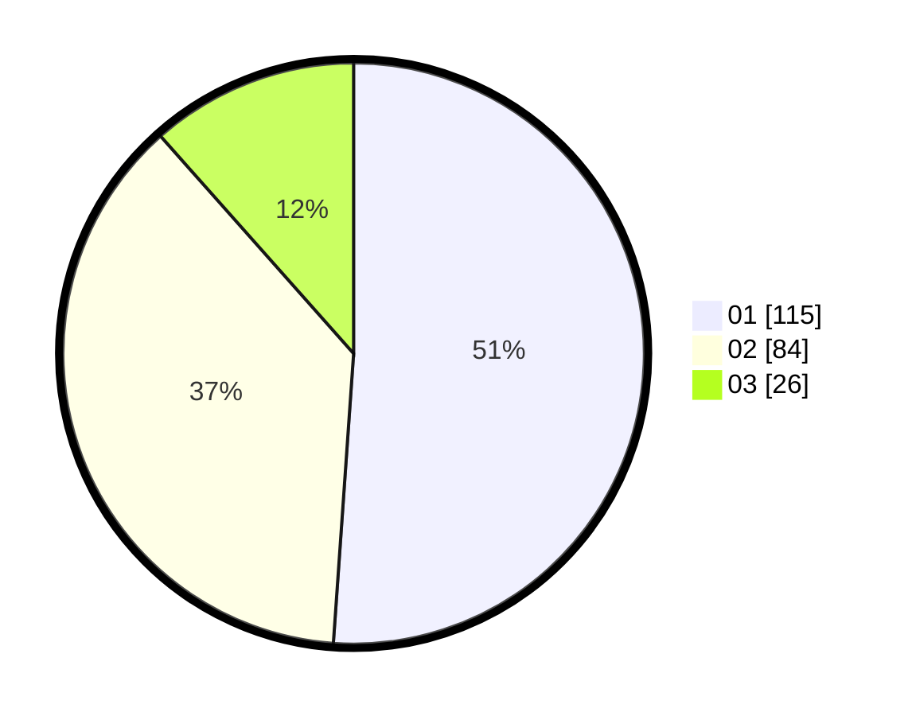

# Hasil

Hasil perolehan suara paslon dapat dilihat pada file paslon-01.txt, paslon-02.txt, dan paslon-03.txt.

Jika tidak ada, artinya data tersebut belum ada pada SIREKAP.

## Perolehan Suara

 * Paslon 01: **115**.
 * Paslon 02: **84**.
 * Paslon 03: **26**.

## Foto C Plano

https://sirekap-obj-formc.kpu.go.id/8f8c/pemilu/ppwp/31/71/06/10/02/3171061002071-20240215-140146--385decd5-77ff-480f-9472-5a377e93133f.jpg

https://sirekap-obj-formc.kpu.go.id/8f8c/pemilu/ppwp/31/71/06/10/02/3171061002071-20240215-140207--9d67a2f3-cba2-4aa4-b87e-ebc0e2a1583d.jpg

https://sirekap-obj-formc.kpu.go.id/8f8c/pemilu/ppwp/31/71/06/10/02/3171061002071-20240215-140156--3df40c05-ad4c-4bbd-972c-131c784d8271.jpg

## DATA PEMILIH TETAP

Jumlah pemilih dalam DPT: **274**.
 * L: **142**.
 * P: **132**.

## DATA PENGGUNA HAK PILIH

Jumlah pengguna hak pilih dalam DPT: **225**.
 * L: **111**.
 * P: **114**.

Jumlah pengguna hak pilih dalam DPTb: **4**.
 * L: **2**.
 * P: **2**.

Jumlah pengguna hak pilih dalam DPK: **1**.
 * L: **1**.
 * P: **0**.

Jumlah pengguna hak pilih: **230**.
 * L: **114**.
 * P: **116**.

## JUMLAH SUARA SAH DAN TIDAK SAH

JUMLAH SELURUH SUARA SAH: **225**.

JUMLAH SUARA TIDAK SAH: **5**.

JUMLAH SELURUH SUARA SAH DAN SUARA TIDAK SAH: **230**.
