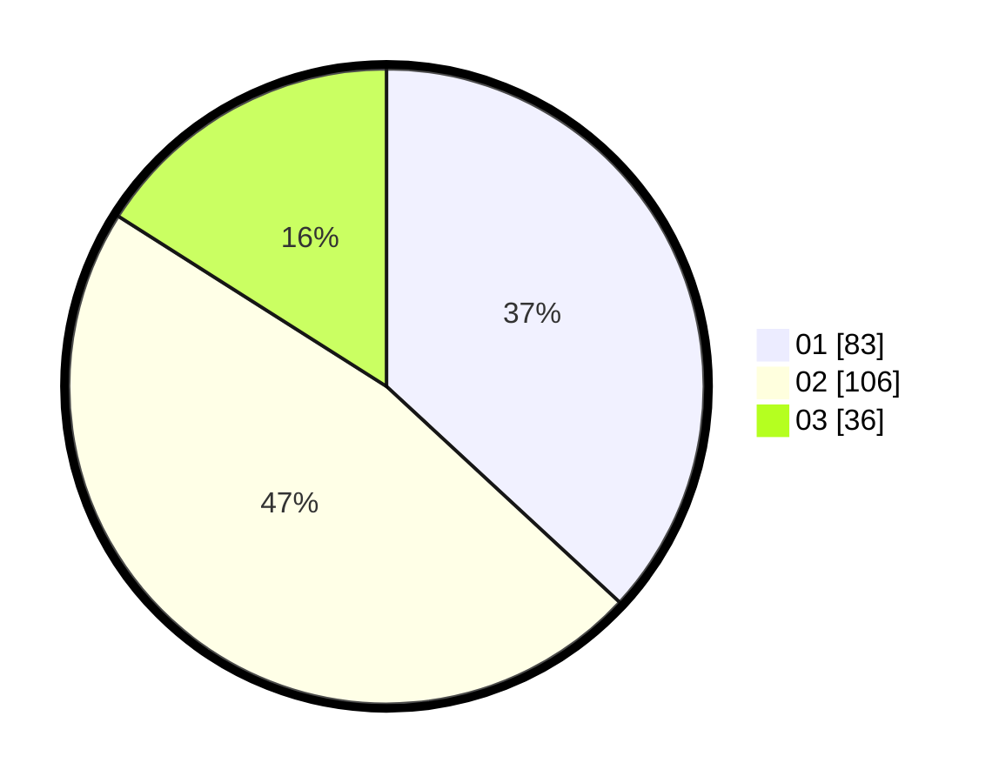

# Hasil

Hasil perolehan suara paslon dapat dilihat pada file paslon-01.txt, paslon-02.txt, dan paslon-03.txt.

Jika tidak ada, artinya data tersebut belum ada pada SIREKAP.

## Perolehan Suara

 * Paslon 01: **83**.
 * Paslon 02: **106**.
 * Paslon 03: **36**.

## Foto C Plano

https://sirekap-obj-formc.kpu.go.id/c150/pemilu/ppwp/31/71/06/10/02/3171061002072-20240214-155845--11f4311d-7b81-4d4a-a687-b603027f60e3.jpg

https://sirekap-obj-formc.kpu.go.id/c150/pemilu/ppwp/31/71/06/10/02/3171061002072-20240214-160119--b68541aa-14c3-492b-b048-a7f5dc93aea5.jpg

https://sirekap-obj-formc.kpu.go.id/c150/pemilu/ppwp/31/71/06/10/02/3171061002072-20240214-184611--0717d200-af80-4043-968c-b39713529174.jpg

## DATA PEMILIH TETAP

Jumlah pemilih dalam DPT: **271**.
 * L: **133**.
 * P: **138**.

## DATA PENGGUNA HAK PILIH

Jumlah pengguna hak pilih dalam DPT: **222**.
 * L: **108**.
 * P: **114**.

Jumlah pengguna hak pilih dalam DPTb: **2**.
 * L: **1**.
 * P: **1**.

Jumlah pengguna hak pilih dalam DPK: **1**.
 * L: **1**.
 * P: **0**.

Jumlah pengguna hak pilih: **225**.
 * L: **110**.
 * P: **115**.

## JUMLAH SUARA SAH DAN TIDAK SAH

JUMLAH SELURUH SUARA SAH: **225**.

JUMLAH SUARA TIDAK SAH: **0**.

JUMLAH SELURUH SUARA SAH DAN SUARA TIDAK SAH: **225**.
