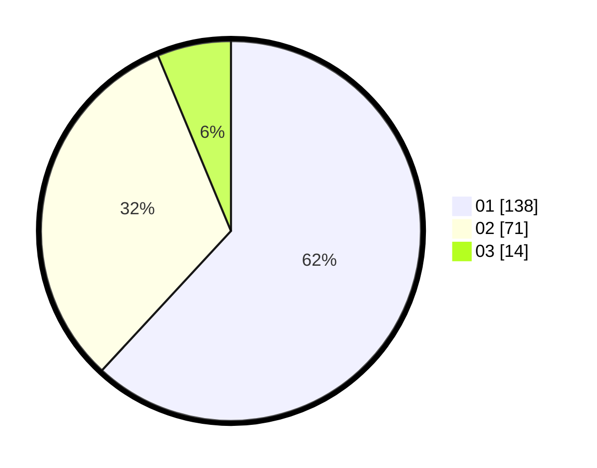

# Hasil

Hasil perolehan suara paslon dapat dilihat pada file paslon-01.txt, paslon-02.txt, dan paslon-03.txt.

Jika tidak ada, artinya data tersebut belum ada pada SIREKAP.

## Perolehan Suara

 * Paslon 01: **138**.
 * Paslon 02: **71**.
 * Paslon 03: **14**.

## Foto C Plano

https://sirekap-obj-formc.kpu.go.id/7f8e/pemilu/ppwp/31/71/06/10/02/3171061002073-20240214-194838--67e7decb-5eb7-4140-b144-1d0724e4dc21.jpg

https://sirekap-obj-formc.kpu.go.id/7f8e/pemilu/ppwp/31/71/06/10/02/3171061002073-20240214-195324--32ff380d-ae32-4ab0-904b-246630629756.jpg

https://sirekap-obj-formc.kpu.go.id/7f8e/pemilu/ppwp/31/71/06/10/02/3171061002073-20240214-200030--d2ea999a-23a1-4bc0-b2f6-de8554bf39f3.jpg

## DATA PEMILIH TETAP

Jumlah pemilih dalam DPT: **289**.
 * L: **144**.
 * P: **145**.

## DATA PENGGUNA HAK PILIH

Jumlah pengguna hak pilih dalam DPT: **227**.
 * L: **111**.
 * P: **116**.

Jumlah pengguna hak pilih dalam DPTb: **1**.
 * L: **0**.
 * P: **1**.

Jumlah pengguna hak pilih dalam DPK: **2**.
 * L: **2**.
 * P: **0**.

Jumlah pengguna hak pilih: **230**.
 * L: **113**.
 * P: **117**.

## JUMLAH SUARA SAH DAN TIDAK SAH

JUMLAH SELURUH SUARA SAH: **223**.

JUMLAH SUARA TIDAK SAH: **7**.

JUMLAH SELURUH SUARA SAH DAN SUARA TIDAK SAH: **230**.
