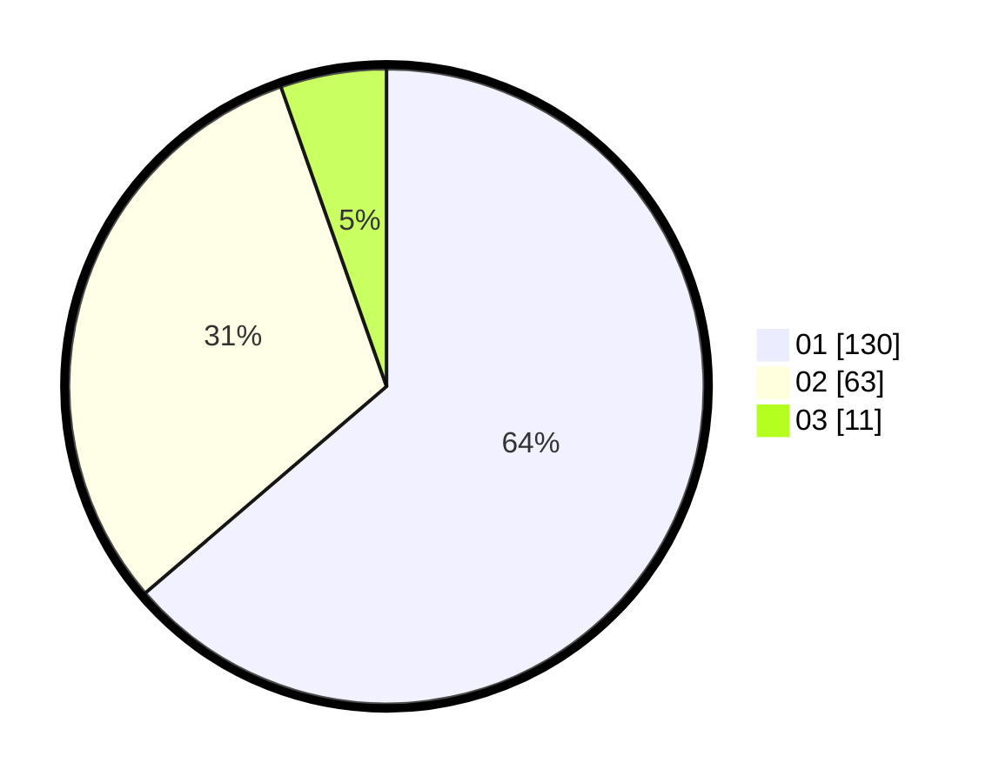

# Hasil

Hasil perolehan suara paslon dapat dilihat pada file paslon-01.txt, paslon-02.txt, dan paslon-03.txt.

Jika tidak ada, artinya data tersebut belum ada pada SIREKAP.

## Perolehan Suara

 * Paslon 01: **130**.
 * Paslon 02: **63**.
 * Paslon 03: **11**.

## Foto C Plano

https://sirekap-obj-formc.kpu.go.id/02c4/pemilu/ppwp/31/71/06/10/02/3171061002075-20240214-220205--6be0b8e8-3932-45e1-8803-9332ae4a1715.jpg

https://sirekap-obj-formc.kpu.go.id/02c4/pemilu/ppwp/31/71/06/10/02/3171061002075-20240214-220220--ecdce06d-fdee-49ff-8c30-916d62c29835.jpg

https://sirekap-obj-formc.kpu.go.id/02c4/pemilu/ppwp/31/71/06/10/02/3171061002075-20240214-220225--f8984360-b38b-41c5-b50d-78b4d0456fa6.jpg

## DATA PEMILIH TETAP

Jumlah pemilih dalam DPT: **261**.
 * L: **127**.
 * P: **134**.

## DATA PENGGUNA HAK PILIH

Jumlah pengguna hak pilih dalam DPT: **199**.
 * L: **96**.
 * P: **103**.

Jumlah pengguna hak pilih dalam DPTb: **4**.
 * L: **2**.
 * P: **2**.

Jumlah pengguna hak pilih dalam DPK: **2**.
 * L: **0**.
 * P: **2**.

Jumlah pengguna hak pilih: **205**.
 * L: **98**.
 * P: **107**.

## JUMLAH SUARA SAH DAN TIDAK SAH

JUMLAH SELURUH SUARA SAH: **204**.

JUMLAH SUARA TIDAK SAH: **1**.

JUMLAH SELURUH SUARA SAH DAN SUARA TIDAK SAH: **205**.
