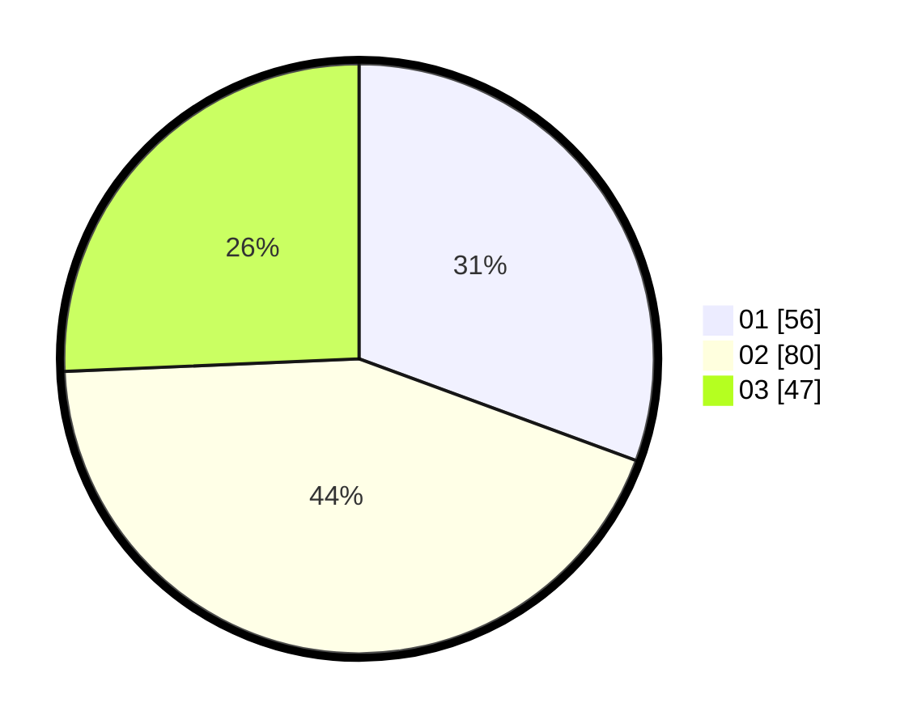

# Hasil

Hasil perolehan suara paslon dapat dilihat pada file paslon-01.txt, paslon-02.txt, dan paslon-03.txt.

Jika tidak ada, artinya data tersebut belum ada pada SIREKAP.

## Perolehan Suara

 * Paslon 01: **56**.
 * Paslon 02: **80**.
 * Paslon 03: **47**.

## Foto C Plano

https://sirekap-obj-formc.kpu.go.id/12b1/pemilu/ppwp/31/71/06/10/03/3171061003001-20240216-180014--b5be07b9-84e0-4760-97df-0b8087cf96e1.jpg

https://sirekap-obj-formc.kpu.go.id/12b1/pemilu/ppwp/31/71/06/10/03/3171061003001-20240216-180145--4cf03bdf-71e0-47ff-b277-e5d25c36a6c0.jpg

https://sirekap-obj-formc.kpu.go.id/12b1/pemilu/ppwp/31/71/06/10/03/3171061003001-20240216-180234--92670786-8e01-4685-afb5-639a75dd45c7.jpg

## DATA PEMILIH TETAP

Jumlah pemilih dalam DPT: **227**.
 * L: **116**.
 * P: **111**.

## DATA PENGGUNA HAK PILIH

Jumlah pengguna hak pilih dalam DPT: **171**.
 * L: **86**.
 * P: **85**.

Jumlah pengguna hak pilih dalam DPTb: **11**.
 * L: **5**.
 * P: **6**.

Jumlah pengguna hak pilih dalam DPK: **3**.
 * L: **2**.
 * P: **1**.

Jumlah pengguna hak pilih: **185**.
 * L: **93**.
 * P: **92**.

## JUMLAH SUARA SAH DAN TIDAK SAH

JUMLAH SELURUH SUARA SAH: **183**.

JUMLAH SUARA TIDAK SAH: **2**.

JUMLAH SELURUH SUARA SAH DAN SUARA TIDAK SAH: **185**.
