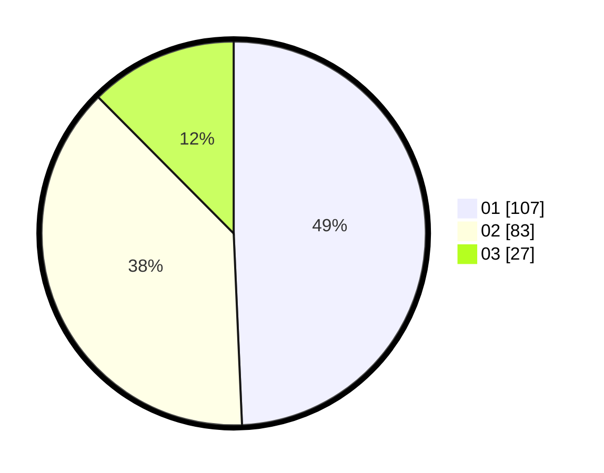

# Hasil

Hasil perolehan suara paslon dapat dilihat pada file paslon-01.txt, paslon-02.txt, dan paslon-03.txt.

Jika tidak ada, artinya data tersebut belum ada pada SIREKAP.

## Perolehan Suara

 * Paslon 01: **107**.
 * Paslon 02: **83**.
 * Paslon 03: **27**.

## Foto C Plano

https://sirekap-obj-formc.kpu.go.id/8c52/pemilu/ppwp/31/71/06/10/03/3171061003004-20240214-221444--a0de7e46-0a1d-4625-9f70-99efc9cb7803.jpg

https://sirekap-obj-formc.kpu.go.id/8c52/pemilu/ppwp/31/71/06/10/03/3171061003004-20240214-221447--e7bd58fd-4f37-47ee-90fd-25910cc18d19.jpg

https://sirekap-obj-formc.kpu.go.id/8c52/pemilu/ppwp/31/71/06/10/03/3171061003004-20240214-221451--64ed7232-d194-4c24-ad93-03c6609200cf.jpg

## DATA PEMILIH TETAP

Jumlah pemilih dalam DPT: **273**.
 * L: **144**.
 * P: **129**.

## DATA PENGGUNA HAK PILIH

Jumlah pengguna hak pilih dalam DPT: **207**.
 * L: **105**.
 * P: **102**.

Jumlah pengguna hak pilih dalam DPTb: **11**.
 * L: **9**.
 * P: **2**.

Jumlah pengguna hak pilih dalam DPK: **4**.
 * L: **1**.
 * P: **3**.

Jumlah pengguna hak pilih: **222**.
 * L: **115**.
 * P: **107**.

## JUMLAH SUARA SAH DAN TIDAK SAH

JUMLAH SELURUH SUARA SAH: **217**.

JUMLAH SUARA TIDAK SAH: **5**.

JUMLAH SELURUH SUARA SAH DAN SUARA TIDAK SAH: **222**.
