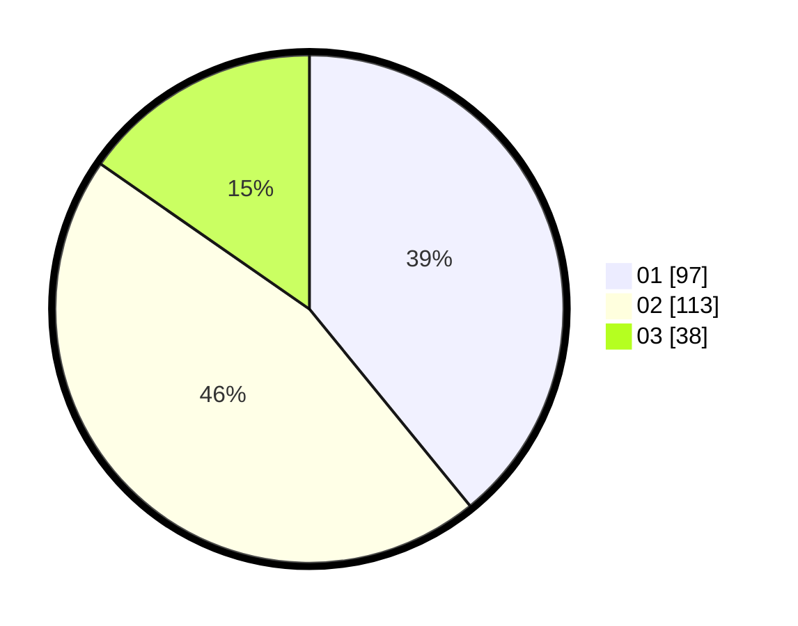

# Hasil

Hasil perolehan suara paslon dapat dilihat pada file paslon-01.txt, paslon-02.txt, dan paslon-03.txt.

Jika tidak ada, artinya data tersebut belum ada pada SIREKAP.

## Perolehan Suara

 * Paslon 01: **97**.
 * Paslon 02: **113**.
 * Paslon 03: **38**.

## Foto C Plano

https://sirekap-obj-formc.kpu.go.id/12d9/pemilu/ppwp/31/71/06/10/03/3171061003005-20240216-152740--45700d00-387b-4881-bfcd-c318c6fb4413.jpg

https://sirekap-obj-formc.kpu.go.id/12d9/pemilu/ppwp/31/71/06/10/03/3171061003005-20240216-152741--fd05908f-bda3-4b23-9c20-8248b52c7b22.jpg

https://sirekap-obj-formc.kpu.go.id/12d9/pemilu/ppwp/31/71/06/10/03/3171061003005-20240216-152741--8fc3797d-6238-450c-9e12-27d7d9ca5446.jpg

## DATA PEMILIH TETAP

Jumlah pemilih dalam DPT: **271**.
 * L: **137**.
 * P: **134**.

## DATA PENGGUNA HAK PILIH

Jumlah pengguna hak pilih dalam DPT: **235**.
 * L: **113**.
 * P: **122**.

Jumlah pengguna hak pilih dalam DPTb: **10**.
 * L: **5**.
 * P: **5**.

Jumlah pengguna hak pilih dalam DPK: **5**.
 * L: **1**.
 * P: **4**.

Jumlah pengguna hak pilih: **250**.
 * L: **119**.
 * P: **131**.

## JUMLAH SUARA SAH DAN TIDAK SAH

JUMLAH SELURUH SUARA SAH: **248**.

JUMLAH SUARA TIDAK SAH: **2**.

JUMLAH SELURUH SUARA SAH DAN SUARA TIDAK SAH: **250**.
