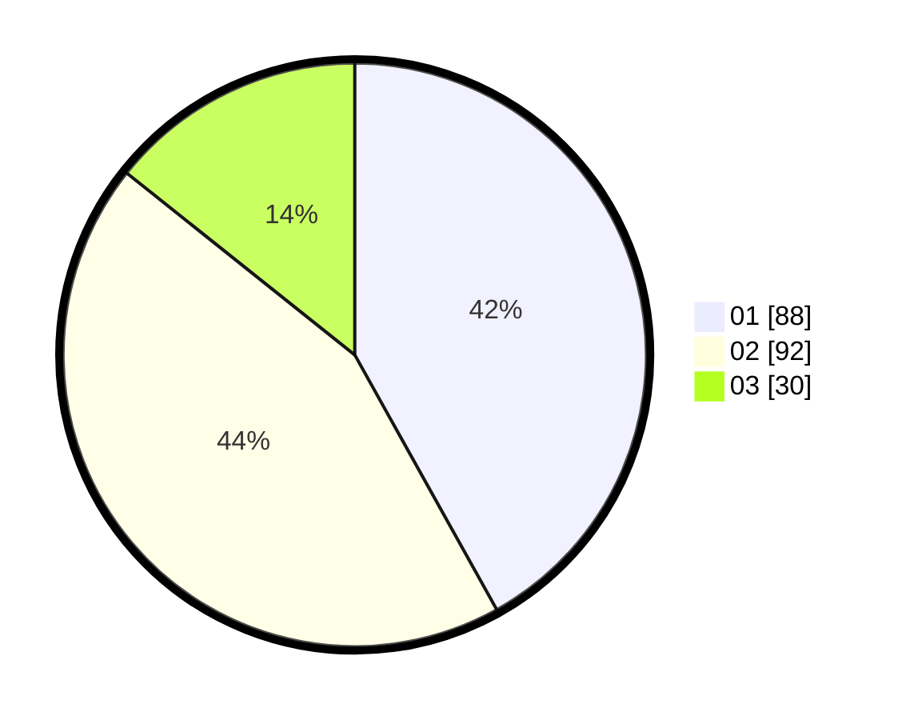

# Hasil

Hasil perolehan suara paslon dapat dilihat pada file paslon-01.txt, paslon-02.txt, dan paslon-03.txt.

Jika tidak ada, artinya data tersebut belum ada pada SIREKAP.

## Perolehan Suara

 * Paslon 01: **88**.
 * Paslon 02: **92**.
 * Paslon 03: **30**.

## Foto C Plano

https://sirekap-obj-formc.kpu.go.id/2a8a/pemilu/ppwp/31/71/06/10/03/3171061003006-20240217-113010--f56ffacf-5bc0-4f2d-bb4c-4dd4c8cb2a44.jpg

https://sirekap-obj-formc.kpu.go.id/2a8a/pemilu/ppwp/31/71/06/10/03/3171061003006-20240217-113012--17d92fd6-264d-4797-b5e0-a7202f9dbe34.jpg

https://sirekap-obj-formc.kpu.go.id/2a8a/pemilu/ppwp/31/71/06/10/03/3171061003006-20240217-113011--71bd4188-3734-4240-9445-a6257a389e4b.jpg

## DATA PEMILIH TETAP

Jumlah pemilih dalam DPT: **214**.
 * L: **99**.
 * P: **115**.

## DATA PENGGUNA HAK PILIH

Jumlah pengguna hak pilih dalam DPT: **203**.
 * L: **94**.
 * P: **109**.

Jumlah pengguna hak pilih dalam DPTb: **9**.
 * L: **4**.
 * P: **5**.

Jumlah pengguna hak pilih dalam DPK: **2**.
 * L: **1**.
 * P: **1**.

Jumlah pengguna hak pilih: **214**.
 * L: **99**.
 * P: **115**.

## JUMLAH SUARA SAH DAN TIDAK SAH

JUMLAH SELURUH SUARA SAH: **210**.

JUMLAH SUARA TIDAK SAH: **4**.

JUMLAH SELURUH SUARA SAH DAN SUARA TIDAK SAH: **214**.
