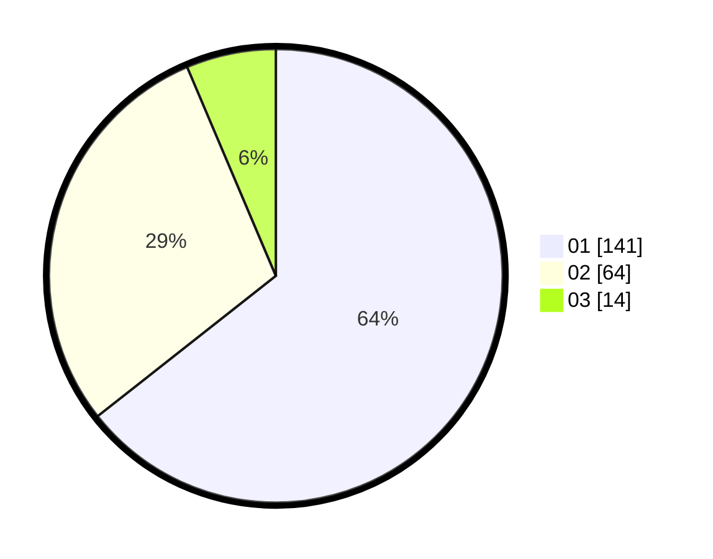

# Hasil

Hasil perolehan suara paslon dapat dilihat pada file paslon-01.txt, paslon-02.txt, dan paslon-03.txt.

Jika tidak ada, artinya data tersebut belum ada pada SIREKAP.

## Perolehan Suara

 * Paslon 01: **141**.
 * Paslon 02: **64**.
 * Paslon 03: **14**.

## Foto C Plano

https://sirekap-obj-formc.kpu.go.id/4b3e/pemilu/ppwp/31/71/06/10/03/3171061003012-20240216-180033--4daa2ffa-1091-4fb2-bbfc-6b50e13f7f83.jpg

https://sirekap-obj-formc.kpu.go.id/4b3e/pemilu/ppwp/31/71/06/10/03/3171061003012-20240216-180213--19eaa75b-3258-4e5e-b914-1e062d565b30.jpg

https://sirekap-obj-formc.kpu.go.id/4b3e/pemilu/ppwp/31/71/06/10/03/3171061003012-20240217-140156--7e13faae-c851-4ff7-bb58-46f6185a8be0.jpg

## DATA PEMILIH TETAP

Jumlah pemilih dalam DPT: **268**.
 * L: **137**.
 * P: **131**.

## DATA PENGGUNA HAK PILIH

Jumlah pengguna hak pilih dalam DPT: **214**.
 * L: **115**.
 * P: **93**.

Jumlah pengguna hak pilih dalam DPTb: **6**.
 * L: **3**.
 * P: **3**.

Jumlah pengguna hak pilih dalam DPK: **2**.
 * L: **1**.
 * P: **1**.

Jumlah pengguna hak pilih: **222**.
 * L: **119**.
 * P: **103**.

## JUMLAH SUARA SAH DAN TIDAK SAH

JUMLAH SELURUH SUARA SAH: **219**.

JUMLAH SUARA TIDAK SAH: **3**.

JUMLAH SELURUH SUARA SAH DAN SUARA TIDAK SAH: **222**.
