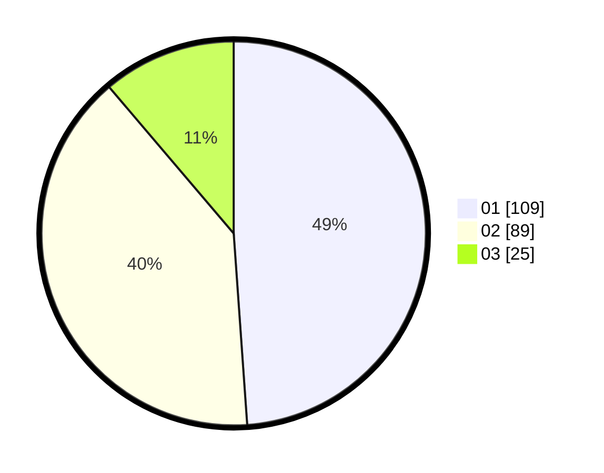

# Hasil

Hasil perolehan suara paslon dapat dilihat pada file paslon-01.txt, paslon-02.txt, dan paslon-03.txt.

Jika tidak ada, artinya data tersebut belum ada pada SIREKAP.

## Perolehan Suara

 * Paslon 01: **109**.
 * Paslon 02: **89**.
 * Paslon 03: **25**.

## Foto C Plano

https://sirekap-obj-formc.kpu.go.id/0e41/pemilu/ppwp/31/71/06/10/03/3171061003014-20240214-200542--544b00b7-f90b-41d6-abbd-83b342a90ac2.jpg

https://sirekap-obj-formc.kpu.go.id/0e41/pemilu/ppwp/31/71/06/10/03/3171061003014-20240214-200656--35fb901f-d2ac-45f0-9054-1562a2ce5211.jpg

https://sirekap-obj-formc.kpu.go.id/0e41/pemilu/ppwp/31/71/06/10/03/3171061003014-20240214-200830--59a229ed-db8d-449b-a692-1180c96a0352.jpg

## DATA PEMILIH TETAP

Jumlah pemilih dalam DPT: **265**.
 * L: **135**.
 * P: **130**.

## DATA PENGGUNA HAK PILIH

Jumlah pengguna hak pilih dalam DPT: **213**.
 * L: **105**.
 * P: **108**.

Jumlah pengguna hak pilih dalam DPTb: **10**.
 * L: **7**.
 * P: **3**.

Jumlah pengguna hak pilih dalam DPK: **3**.
 * L: **1**.
 * P: **2**.

Jumlah pengguna hak pilih: **226**.
 * L: **113**.
 * P: **113**.

## JUMLAH SUARA SAH DAN TIDAK SAH

JUMLAH SELURUH SUARA SAH: **223**.

JUMLAH SUARA TIDAK SAH: **3**.

JUMLAH SELURUH SUARA SAH DAN SUARA TIDAK SAH: **226**.
