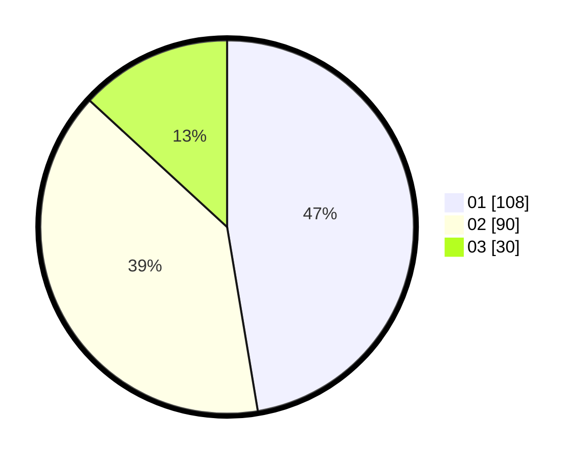

# Hasil

Hasil perolehan suara paslon dapat dilihat pada file paslon-01.txt, paslon-02.txt, dan paslon-03.txt.

Jika tidak ada, artinya data tersebut belum ada pada SIREKAP.

## Perolehan Suara

 * Paslon 01: **108**.
 * Paslon 02: **90**.
 * Paslon 03: **30**.

## Foto C Plano

https://sirekap-obj-formc.kpu.go.id/c139/pemilu/ppwp/31/71/06/10/03/3171061003015-20240215-002358--d64e230e-c340-41b6-b981-9845340c6072.jpg

https://sirekap-obj-formc.kpu.go.id/c139/pemilu/ppwp/31/71/06/10/03/3171061003015-20240215-002447--1efba3ed-379a-476c-958a-466ff59ecb22.jpg
