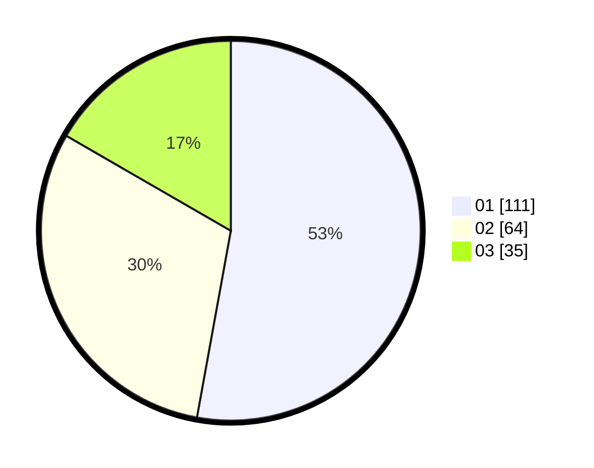

# Hasil

Hasil perolehan suara paslon dapat dilihat pada file paslon-01.txt, paslon-02.txt, dan paslon-03.txt.

Jika tidak ada, artinya data tersebut belum ada pada SIREKAP.

## Perolehan Suara

 * Paslon 01: **111**.
 * Paslon 02: **64**.
 * Paslon 03: **35**.

## Foto C Plano

https://sirekap-obj-formc.kpu.go.id/dbcd/pemilu/ppwp/31/71/06/10/03/3171061003020-20240216-134041--7df4a7fc-9f97-4947-ad0e-1186802bd4bc.jpg

https://sirekap-obj-formc.kpu.go.id/dbcd/pemilu/ppwp/31/71/06/10/03/3171061003020-20240216-134042--728f600b-a525-4de2-be95-e2a2c1a43f71.jpg

https://sirekap-obj-formc.kpu.go.id/dbcd/pemilu/ppwp/31/71/06/10/03/3171061003020-20240216-134041--84bfa2d0-c07b-4f40-a41b-565af3f992f5.jpg

## DATA PEMILIH TETAP

Jumlah pemilih dalam DPT: **261**.
 * L: **119**.
 * P: **142**.

## DATA PENGGUNA HAK PILIH

Jumlah pengguna hak pilih dalam DPT: **195**.
 * L: **87**.
 * P: **108**.

Jumlah pengguna hak pilih dalam DPTb: **14**.
 * L: **4**.
 * P: **10**.

Jumlah pengguna hak pilih dalam DPK: **3**.
 * L: **0**.
 * P: **3**.

Jumlah pengguna hak pilih: **212**.
 * L: **91**.
 * P: **121**.

## JUMLAH SUARA SAH DAN TIDAK SAH

JUMLAH SELURUH SUARA SAH: **210**.

JUMLAH SUARA TIDAK SAH: **2**.

JUMLAH SELURUH SUARA SAH DAN SUARA TIDAK SAH: **212**.
