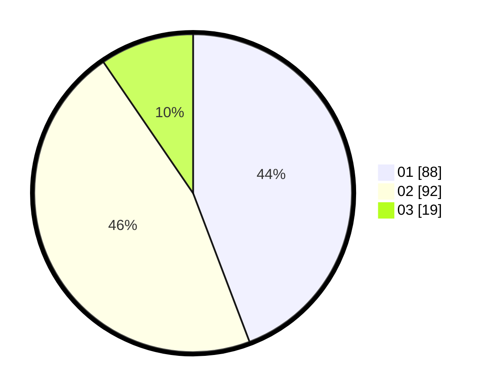

# Hasil

Hasil perolehan suara paslon dapat dilihat pada file paslon-01.txt, paslon-02.txt, dan paslon-03.txt.

Jika tidak ada, artinya data tersebut belum ada pada SIREKAP.

## Perolehan Suara

 * Paslon 01: **88**.
 * Paslon 02: **92**.
 * Paslon 03: **19**.

## Foto C Plano

https://sirekap-obj-formc.kpu.go.id/6e85/pemilu/ppwp/31/71/06/10/03/3171061003023-20240216-152009--99c80f03-655a-499a-a87c-88e0fc1813c3.jpg

https://sirekap-obj-formc.kpu.go.id/6e85/pemilu/ppwp/31/71/06/10/03/3171061003023-20240216-152148--4a06d829-f6db-44cd-9b6c-e5169cc73afa.jpg

https://sirekap-obj-formc.kpu.go.id/6e85/pemilu/ppwp/31/71/06/10/03/3171061003023-20240216-152419--bbcbebc6-8107-40fe-9878-f72338f00271.jpg

## DATA PEMILIH TETAP

Jumlah pemilih dalam DPT: **261**.
 * L: **122**.
 * P: **139**.

## DATA PENGGUNA HAK PILIH

Jumlah pengguna hak pilih dalam DPT: **194**.
 * L: **88**.
 * P: **108**.

Jumlah pengguna hak pilih dalam DPTb: **6**.
 * L: **0**.
 * P: **6**.

Jumlah pengguna hak pilih dalam DPK: **3**.
 * L: **1**.
 * P: **2**.

Jumlah pengguna hak pilih: **203**.
 * L: **89**.
 * P: **116**.

## JUMLAH SUARA SAH DAN TIDAK SAH

JUMLAH SELURUH SUARA SAH: **199**.

JUMLAH SUARA TIDAK SAH: **4**.

JUMLAH SELURUH SUARA SAH DAN SUARA TIDAK SAH: **203**.
