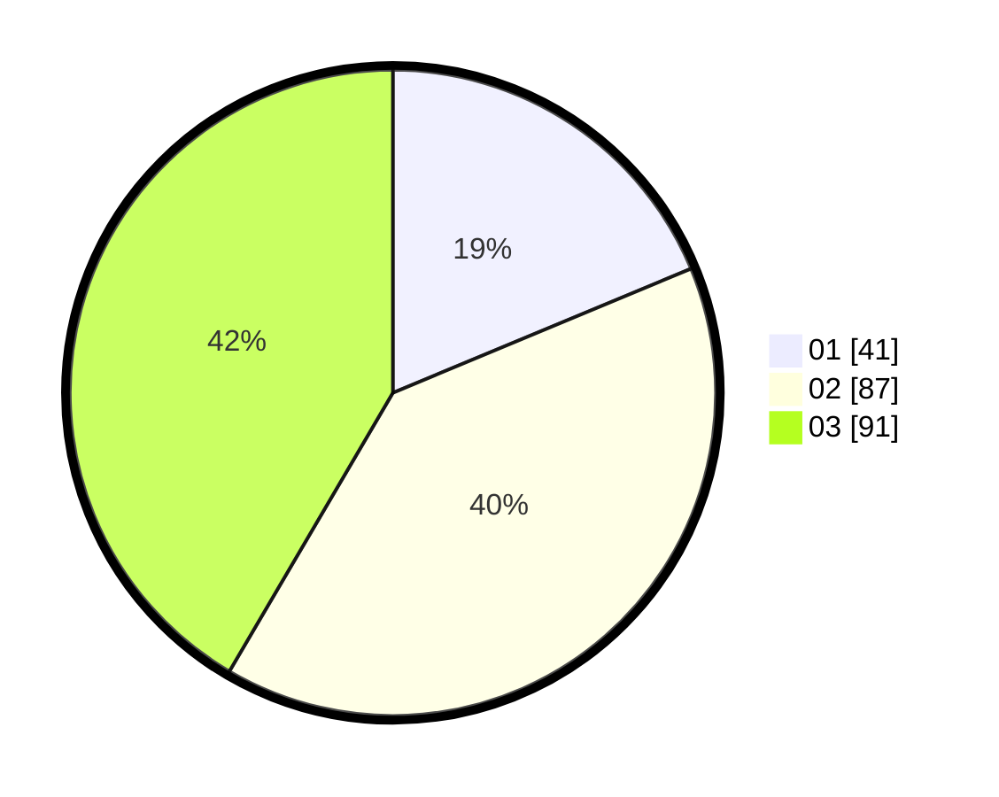

# Hasil

Hasil perolehan suara paslon dapat dilihat pada file paslon-01.txt, paslon-02.txt, dan paslon-03.txt.

Jika tidak ada, artinya data tersebut belum ada pada SIREKAP.

## Perolehan Suara

 * Paslon 01: **41**.
 * Paslon 02: **87**.
 * Paslon 03: **91**.

## Foto C Plano

https://sirekap-obj-formc.kpu.go.id/c060/pemilu/ppwp/31/71/06/10/03/3171061003024-20240214-235837--885701be-7876-4244-b64a-ac873c792832.jpg

https://sirekap-obj-formc.kpu.go.id/c060/pemilu/ppwp/31/71/06/10/03/3171061003024-20240214-235602--ebaba1e5-4213-4831-9c53-2bdc6b5d9db9.jpg
