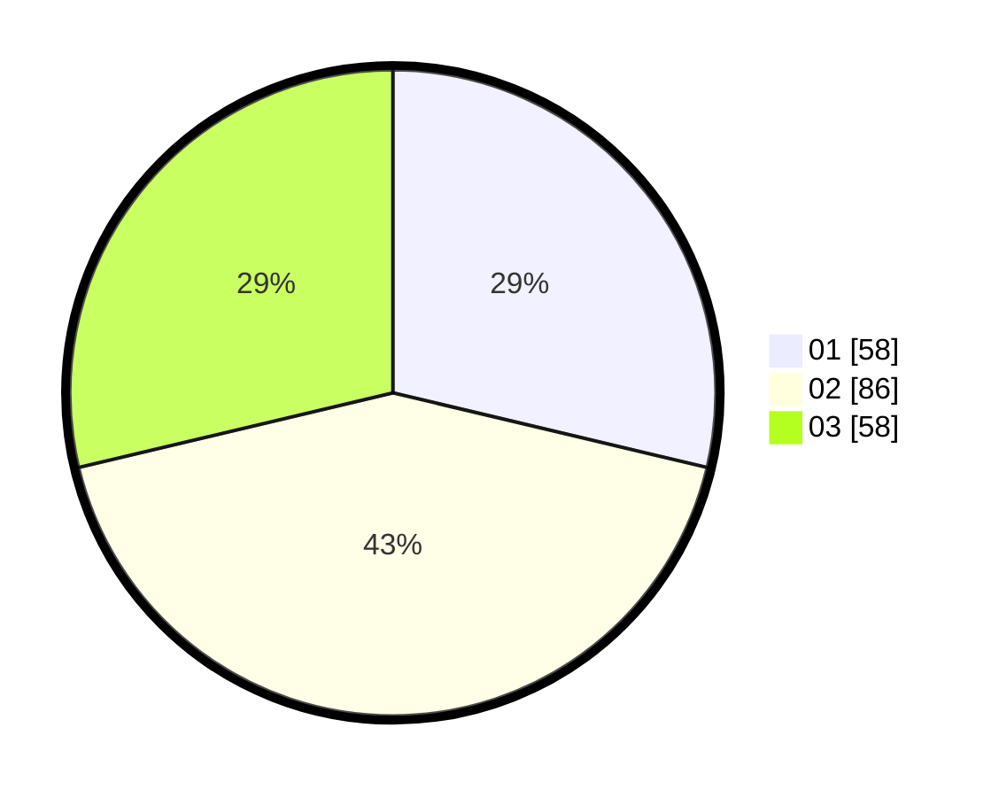

# Hasil

Hasil perolehan suara paslon dapat dilihat pada file paslon-01.txt, paslon-02.txt, dan paslon-03.txt.

Jika tidak ada, artinya data tersebut belum ada pada SIREKAP.

## Perolehan Suara

 * Paslon 01: **58**.
 * Paslon 02: **86**.
 * Paslon 03: **58**.

## Foto C Plano

https://sirekap-obj-formc.kpu.go.id/2e2e/pemilu/ppwp/31/71/06/10/03/3171061003026-20240216-181625--4a35831e-20c0-4084-9229-d04d0579b9cf.jpg

https://sirekap-obj-formc.kpu.go.id/2e2e/pemilu/ppwp/31/71/06/10/03/3171061003026-20240216-182245--8786e89f-9c03-4586-845f-9258390a8e99.jpg

https://sirekap-obj-formc.kpu.go.id/2e2e/pemilu/ppwp/31/71/06/10/03/3171061003026-20240216-182410--b03ca123-cefa-4f85-92a1-33931163d58f.jpg

## DATA PEMILIH TETAP

Jumlah pemilih dalam DPT: **246**.
 * L: **129**.
 * P: **117**.

## DATA PENGGUNA HAK PILIH

Jumlah pengguna hak pilih dalam DPT: **177**.
 * L: **96**.
 * P: **81**.

Jumlah pengguna hak pilih dalam DPTb: **23**.
 * L: **12**.
 * P: **11**.

Jumlah pengguna hak pilih dalam DPK: **4**.
 * L: **1**.
 * P: **3**.

Jumlah pengguna hak pilih: **204**.
 * L: **109**.
 * P: **95**.

## JUMLAH SUARA SAH DAN TIDAK SAH

JUMLAH SELURUH SUARA SAH: **202**.

JUMLAH SUARA TIDAK SAH: **2**.

JUMLAH SELURUH SUARA SAH DAN SUARA TIDAK SAH: **204**.
