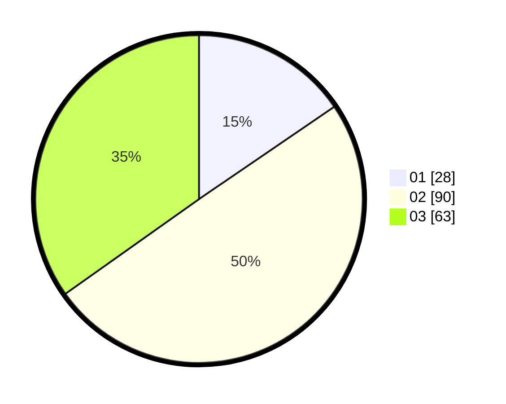

# Hasil

Hasil perolehan suara paslon dapat dilihat pada file paslon-01.txt, paslon-02.txt, dan paslon-03.txt.

Jika tidak ada, artinya data tersebut belum ada pada SIREKAP.

## Perolehan Suara

 * Paslon 01: **28**.
 * Paslon 02: **90**.
 * Paslon 03: **63**.

## Foto C Plano

https://sirekap-obj-formc.kpu.go.id/3296/pemilu/ppwp/31/71/06/10/03/3171061003027-20240217-021025--6d32f188-e245-4357-8416-a2b8386b0d57.jpg

https://sirekap-obj-formc.kpu.go.id/3296/pemilu/ppwp/31/71/06/10/03/3171061003027-20240217-021250--8cf57010-5333-4b7c-b5e2-9889c69ec3d4.jpg

https://sirekap-obj-formc.kpu.go.id/3296/pemilu/ppwp/31/71/06/10/03/3171061003027-20240219-133238--c54727e2-eb98-4761-9963-6293fd58652e.jpg

## DATA PEMILIH TETAP

Jumlah pemilih dalam DPT: **211**.
 * L: **94**.
 * P: **117**.

## DATA PENGGUNA HAK PILIH

Jumlah pengguna hak pilih dalam DPT: **159**.
 * L: **72**.
 * P: **87**.

Jumlah pengguna hak pilih dalam DPTb: **16**.
 * L: **6**.
 * P: **10**.

Jumlah pengguna hak pilih dalam DPK: **7**.
 * L: **1**.
 * P: **6**.

Jumlah pengguna hak pilih: **182**.
 * L: **79**.
 * P: **103**.

## JUMLAH SUARA SAH DAN TIDAK SAH

JUMLAH SELURUH SUARA SAH: **181**.

JUMLAH SUARA TIDAK SAH: **1**.

JUMLAH SELURUH SUARA SAH DAN SUARA TIDAK SAH: **182**.
