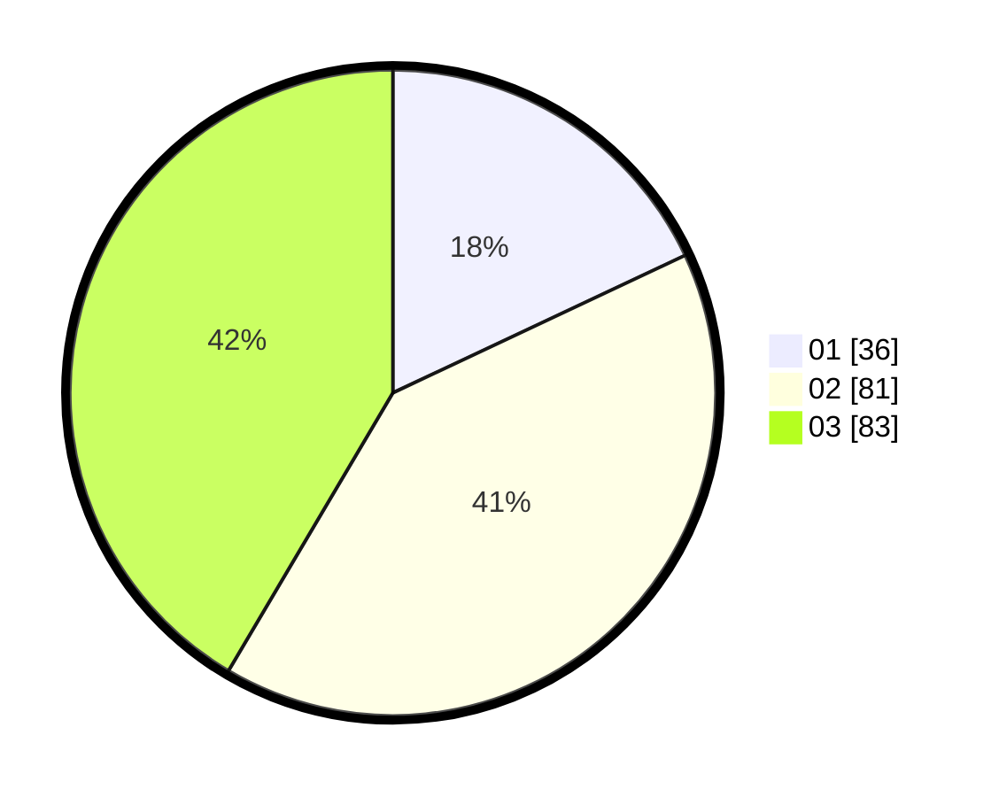

# Hasil

Hasil perolehan suara paslon dapat dilihat pada file paslon-01.txt, paslon-02.txt, dan paslon-03.txt.

Jika tidak ada, artinya data tersebut belum ada pada SIREKAP.

## Perolehan Suara

 * Paslon 01: **36**.
 * Paslon 02: **81**.
 * Paslon 03: **83**.

## Foto C Plano

https://sirekap-obj-formc.kpu.go.id/717c/pemilu/ppwp/31/71/06/10/04/3171061004003-20240216-171102--6b4c6a92-aea8-4a14-b15d-89a05e161351.jpg

https://sirekap-obj-formc.kpu.go.id/717c/pemilu/ppwp/31/71/06/10/04/3171061004003-20240216-171103--561d6ac5-e100-4920-82bd-aa1042e94e41.jpg

https://sirekap-obj-formc.kpu.go.id/717c/pemilu/ppwp/31/71/06/10/04/3171061004003-20240216-171103--0f417df8-9e18-4433-ab15-0ace956ff825.jpg

## DATA PEMILIH TETAP

Jumlah pemilih dalam DPT: **268**.
 * L: **127**.
 * P: **141**.

## DATA PENGGUNA HAK PILIH

Jumlah pengguna hak pilih dalam DPT: **178**.
 * L: **85**.
 * P: **93**.

Jumlah pengguna hak pilih dalam DPTb: **24**.
 * L: **10**.
 * P: **14**.

Jumlah pengguna hak pilih dalam DPK: **2**.
 * L: **1**.
 * P: **1**.

Jumlah pengguna hak pilih: **204**.
 * L: **96**.
 * P: **108**.

## JUMLAH SUARA SAH DAN TIDAK SAH

JUMLAH SELURUH SUARA SAH: **200**.

JUMLAH SUARA TIDAK SAH: **4**.

JUMLAH SELURUH SUARA SAH DAN SUARA TIDAK SAH: **204**.
