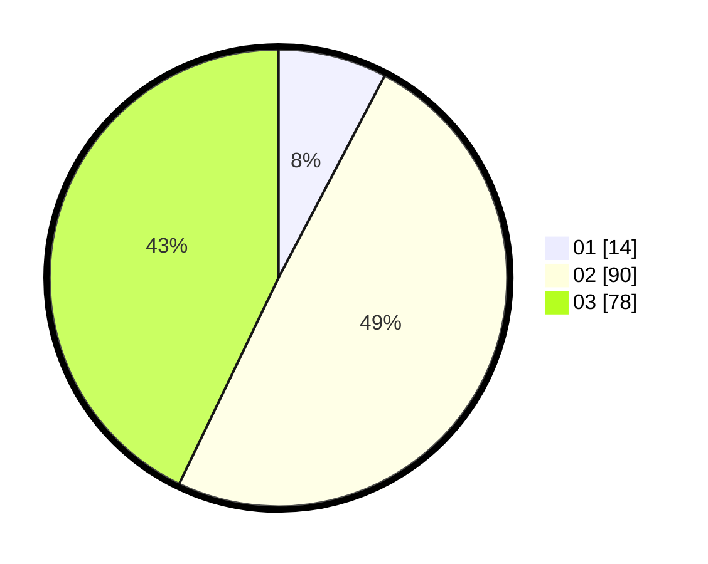

# Hasil

Hasil perolehan suara paslon dapat dilihat pada file paslon-01.txt, paslon-02.txt, dan paslon-03.txt.

Jika tidak ada, artinya data tersebut belum ada pada SIREKAP.

## Perolehan Suara

 * Paslon 01: **14**.
 * Paslon 02: **90**.
 * Paslon 03: **78**.

## Foto C Plano

https://sirekap-obj-formc.kpu.go.id/815d/pemilu/ppwp/31/71/06/10/04/3171061004006-20240216-231506--eb27e615-1251-431c-a7ec-ebf5150e2798.jpg

https://sirekap-obj-formc.kpu.go.id/815d/pemilu/ppwp/31/71/06/10/04/3171061004006-20240216-232728--c38e7e2b-5276-4a5a-b323-7740e1b4fdd3.jpg

https://sirekap-obj-formc.kpu.go.id/815d/pemilu/ppwp/31/71/06/10/04/3171061004006-20240216-233216--d3f76cd5-23f9-42eb-9869-be9d93ebd867.jpg

## DATA PEMILIH TETAP

Jumlah pemilih dalam DPT: **254**.
 * L: **134**.
 * P: **120**.

## DATA PENGGUNA HAK PILIH

Jumlah pengguna hak pilih dalam DPT: **154**.
 * L: **80**.
 * P: **74**.

Jumlah pengguna hak pilih dalam DPTb: **16**.
 * L: **5**.
 * P: **11**.

Jumlah pengguna hak pilih dalam DPK: **12**.
 * L: **7**.
 * P: **5**.

Jumlah pengguna hak pilih: **182**.
 * L: **92**.
 * P: **90**.

## JUMLAH SUARA SAH DAN TIDAK SAH

JUMLAH SELURUH SUARA SAH: **182**.

JUMLAH SUARA TIDAK SAH: **0**.

JUMLAH SELURUH SUARA SAH DAN SUARA TIDAK SAH: **182**.
