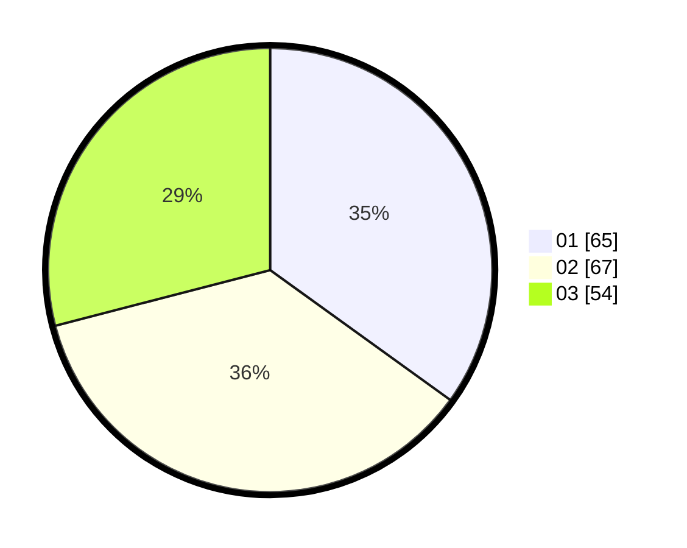

# Hasil

Hasil perolehan suara paslon dapat dilihat pada file paslon-01.txt, paslon-02.txt, dan paslon-03.txt.

Jika tidak ada, artinya data tersebut belum ada pada SIREKAP.

## Perolehan Suara

 * Paslon 01: **65**.
 * Paslon 02: **67**.
 * Paslon 03: **54**.

## Foto C Plano

https://sirekap-obj-formc.kpu.go.id/b204/pemilu/ppwp/31/71/06/10/04/3171061004008-20240217-100449--493c0085-14ad-4c7e-a0f7-50d1056bba6c.jpg

https://sirekap-obj-formc.kpu.go.id/b204/pemilu/ppwp/31/71/06/10/04/3171061004008-20240217-100617--1f50afbf-6407-4766-9401-c838b6a0ec7a.jpg

https://sirekap-obj-formc.kpu.go.id/b204/pemilu/ppwp/31/71/06/10/04/3171061004008-20240217-100813--5eb9d70b-ebcc-404d-b68d-85c6ebb93892.jpg

## DATA PEMILIH TETAP

Jumlah pemilih dalam DPT: **231**.
 * L: **111**.
 * P: **120**.

## DATA PENGGUNA HAK PILIH

Jumlah pengguna hak pilih dalam DPT: **160**.
 * L: **78**.
 * P: **82**.

Jumlah pengguna hak pilih dalam DPTb: **31**.
 * L: **6**.
 * P: **25**.

Jumlah pengguna hak pilih dalam DPK: **2**.
 * L: **0**.
 * P: **2**.

Jumlah pengguna hak pilih: **193**.
 * L: **84**.
 * P: **109**.

## JUMLAH SUARA SAH DAN TIDAK SAH

JUMLAH SELURUH SUARA SAH: **191**.

JUMLAH SUARA TIDAK SAH: **2**.

JUMLAH SELURUH SUARA SAH DAN SUARA TIDAK SAH: **193**.
