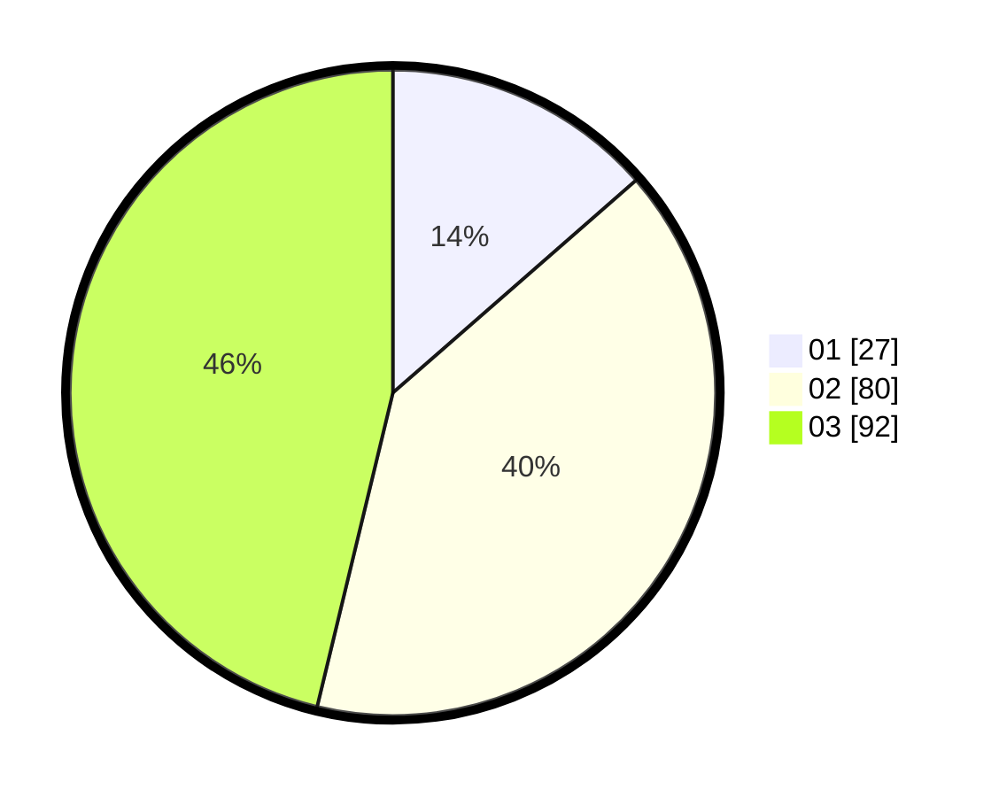

# Hasil

Hasil perolehan suara paslon dapat dilihat pada file paslon-01.txt, paslon-02.txt, dan paslon-03.txt.

Jika tidak ada, artinya data tersebut belum ada pada SIREKAP.

## Perolehan Suara

 * Paslon 01: **27**.
 * Paslon 02: **80**.
 * Paslon 03: **92**.

## Foto C Plano

https://sirekap-obj-formc.kpu.go.id/b986/pemilu/ppwp/31/71/06/10/04/3171061004010-20240215-024807--43164e79-495b-4c25-a87d-0a46799064c7.jpg

https://sirekap-obj-formc.kpu.go.id/b986/pemilu/ppwp/31/71/06/10/04/3171061004010-20240215-024828--1c96d039-5892-48f6-bb70-6364e4e095f6.jpg

https://sirekap-obj-formc.kpu.go.id/b986/pemilu/ppwp/31/71/06/10/04/3171061004010-20240215-024817--0811f392-73ab-4657-9bcf-2963f74536ae.jpg

## DATA PEMILIH TETAP

Jumlah pemilih dalam DPT: **280**.
 * L: **117**.
 * P: **163**.

## DATA PENGGUNA HAK PILIH

Jumlah pengguna hak pilih dalam DPT: **174**.
 * L: **75**.
 * P: **99**.

Jumlah pengguna hak pilih dalam DPTb: **24**.
 * L: **9**.
 * P: **15**.

Jumlah pengguna hak pilih dalam DPK: **4**.
 * L: **2**.
 * P: **2**.

Jumlah pengguna hak pilih: **202**.
 * L: **86**.
 * P: **116**.

## JUMLAH SUARA SAH DAN TIDAK SAH

JUMLAH SELURUH SUARA SAH: **199**.

JUMLAH SUARA TIDAK SAH: **3**.

JUMLAH SELURUH SUARA SAH DAN SUARA TIDAK SAH: **202**.
