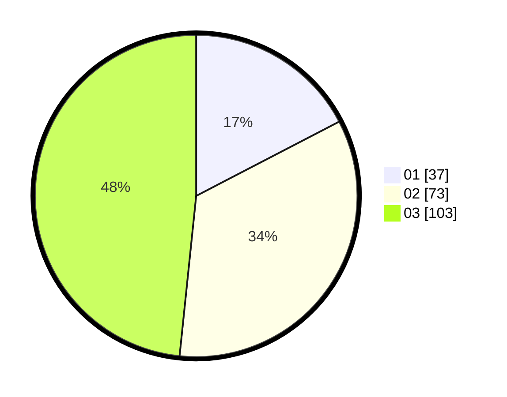

# Hasil

Hasil perolehan suara paslon dapat dilihat pada file paslon-01.txt, paslon-02.txt, dan paslon-03.txt.

Jika tidak ada, artinya data tersebut belum ada pada SIREKAP.

## Perolehan Suara

 * Paslon 01: **37**.
 * Paslon 02: **73**.
 * Paslon 03: **103**.

## Foto C Plano

https://sirekap-obj-formc.kpu.go.id/c3a5/pemilu/ppwp/31/71/06/10/04/3171061004012-20240216-175633--49e6966f-db64-4a3f-b8a2-7544e66db7e7.jpg

https://sirekap-obj-formc.kpu.go.id/c3a5/pemilu/ppwp/31/71/06/10/04/3171061004012-20240216-175635--8ff1cfec-9020-42bf-9b4b-f257121a722b.jpg

https://sirekap-obj-formc.kpu.go.id/c3a5/pemilu/ppwp/31/71/06/10/04/3171061004012-20240216-175634--f461cada-3222-407f-b766-78ed0c205c42.jpg

## DATA PEMILIH TETAP

Jumlah pemilih dalam DPT: **271**.
 * L: **123**.
 * P: **148**.

## DATA PENGGUNA HAK PILIH

Jumlah pengguna hak pilih dalam DPT: **172**.
 * L: **83**.
 * P: **89**.

Jumlah pengguna hak pilih dalam DPTb: **35**.
 * L: **13**.
 * P: **22**.

Jumlah pengguna hak pilih dalam DPK: **7**.
 * L: **3**.
 * P: **4**.

Jumlah pengguna hak pilih: **214**.
 * L: **99**.
 * P: **115**.

## JUMLAH SUARA SAH DAN TIDAK SAH

JUMLAH SELURUH SUARA SAH: **213**.

JUMLAH SUARA TIDAK SAH: **1**.

JUMLAH SELURUH SUARA SAH DAN SUARA TIDAK SAH: **214**.
