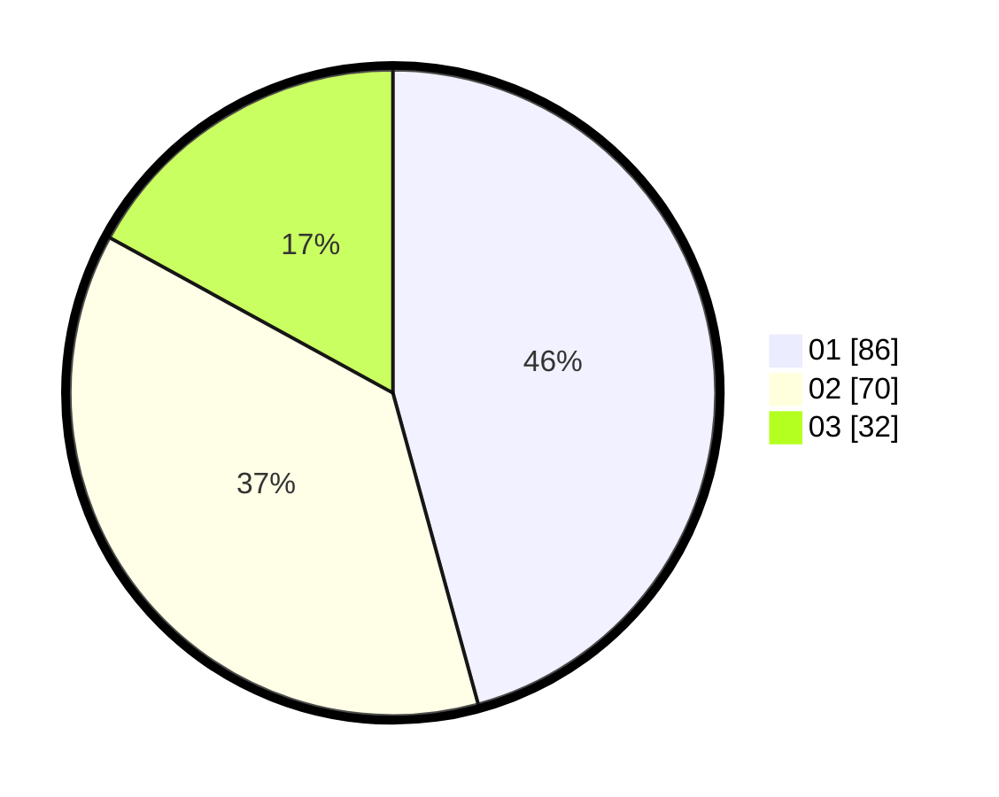

# Hasil

Hasil perolehan suara paslon dapat dilihat pada file paslon-01.txt, paslon-02.txt, dan paslon-03.txt.

Jika tidak ada, artinya data tersebut belum ada pada SIREKAP.

## Perolehan Suara

 * Paslon 01: **86**.
 * Paslon 02: **70**.
 * Paslon 03: **32**.

## Foto C Plano

https://sirekap-obj-formc.kpu.go.id/ef6d/pemilu/ppwp/31/71/06/10/05/3171061005003-20240216-143853--1ac26b6c-34d6-4f15-aa24-7681c8a65c8b.jpg

https://sirekap-obj-formc.kpu.go.id/ef6d/pemilu/ppwp/31/71/06/10/05/3171061005003-20240216-143855--120e9cc0-4ada-47d1-972c-ff0337504367.jpg

https://sirekap-obj-formc.kpu.go.id/ef6d/pemilu/ppwp/31/71/06/10/05/3171061005003-20240216-155915--3d90eac2-46ad-4458-86e1-76564091e857.jpg

## DATA PEMILIH TETAP

Jumlah pemilih dalam DPT: **248**.
 * L: **128**.
 * P: **120**.

## DATA PENGGUNA HAK PILIH

Jumlah pengguna hak pilih dalam DPT: **176**.
 * L: **84**.
 * P: **92**.

Jumlah pengguna hak pilih dalam DPTb: **13**.
 * L: **10**.
 * P: **3**.

Jumlah pengguna hak pilih dalam DPK: **0**.
 * L: **0**.
 * P: **0**.

Jumlah pengguna hak pilih: **189**.
 * L: **94**.
 * P: **95**.

## JUMLAH SUARA SAH DAN TIDAK SAH

JUMLAH SELURUH SUARA SAH: **188**.

JUMLAH SUARA TIDAK SAH: **1**.

JUMLAH SELURUH SUARA SAH DAN SUARA TIDAK SAH: **189**.
