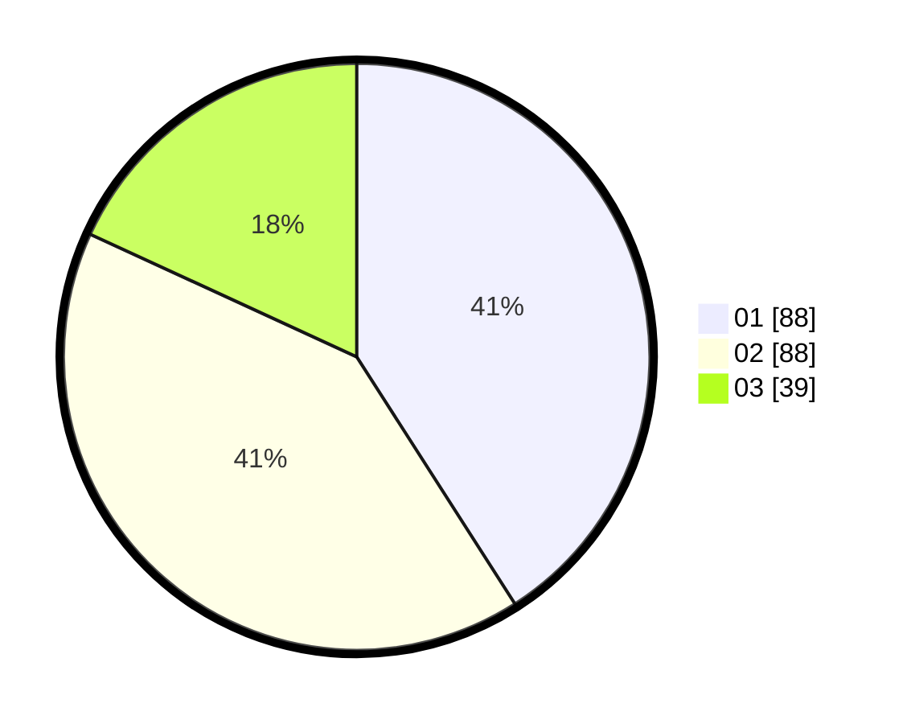

# Hasil

Hasil perolehan suara paslon dapat dilihat pada file paslon-01.txt, paslon-02.txt, dan paslon-03.txt.

Jika tidak ada, artinya data tersebut belum ada pada SIREKAP.

## Perolehan Suara

 * Paslon 01: **88**.
 * Paslon 02: **88**.
 * Paslon 03: **39**.

## Foto C Plano

https://sirekap-obj-formc.kpu.go.id/e6fd/pemilu/ppwp/31/71/06/10/05/3171061005004-20240217-231628--95d980a1-5756-4cd1-95ea-a79f577ce6ea.jpg

https://sirekap-obj-formc.kpu.go.id/e6fd/pemilu/ppwp/31/71/06/10/05/3171061005004-20240217-232325--9bec9e70-fa15-46c6-b688-b5e7617afc5c.jpg

https://sirekap-obj-formc.kpu.go.id/e6fd/pemilu/ppwp/31/71/06/10/05/3171061005004-20240217-145327--bc5d7983-d0ff-4579-9cfa-4a644754c71b.jpg

## DATA PEMILIH TETAP

Jumlah pemilih dalam DPT: **253**.
 * L: **121**.
 * P: **132**.

## DATA PENGGUNA HAK PILIH

Jumlah pengguna hak pilih dalam DPT: **205**.
 * L: **43**.
 * P: **112**.

Jumlah pengguna hak pilih dalam DPTb: **62**.
 * L: **11**.
 * P: **1**.

Jumlah pengguna hak pilih dalam DPK: **0**.
 * L: **0**.
 * P: **0**.

Jumlah pengguna hak pilih: **217**.
 * L: **104**.
 * P: **113**.

## JUMLAH SUARA SAH DAN TIDAK SAH

JUMLAH SELURUH SUARA SAH: **215**.

JUMLAH SUARA TIDAK SAH: **2**.

JUMLAH SELURUH SUARA SAH DAN SUARA TIDAK SAH: **217**.
