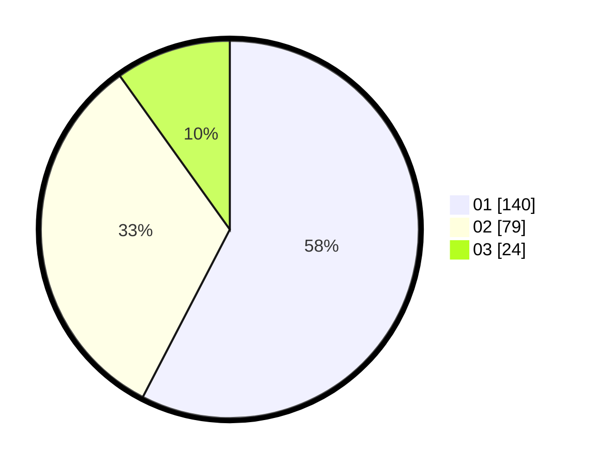

# Hasil

Hasil perolehan suara paslon dapat dilihat pada file paslon-01.txt, paslon-02.txt, dan paslon-03.txt.

Jika tidak ada, artinya data tersebut belum ada pada SIREKAP.

## Perolehan Suara

 * Paslon 01: **140**.
 * Paslon 02: **79**.
 * Paslon 03: **24**.

## Foto C Plano

https://sirekap-obj-formc.kpu.go.id/7db6/pemilu/ppwp/31/71/06/10/05/3171061005008-20240215-002209--c737add5-3c73-4d73-a198-eedfc1a23702.jpg

https://sirekap-obj-formc.kpu.go.id/7db6/pemilu/ppwp/31/71/06/10/05/3171061005008-20240215-002432--85b762cc-f823-49e9-9f40-50e973ce3f51.jpg

https://sirekap-obj-formc.kpu.go.id/7db6/pemilu/ppwp/31/71/06/10/05/3171061005008-20240215-002614--fa097193-7684-4384-84bd-d18f1d81e30a.jpg

## DATA PEMILIH TETAP

Jumlah pemilih dalam DPT: **290**.
 * L: **151**.
 * P: **139**.

## DATA PENGGUNA HAK PILIH

Jumlah pengguna hak pilih dalam DPT: **226**.
 * L: **113**.
 * P: **113**.

Jumlah pengguna hak pilih dalam DPTb: **17**.
 * L: **9**.
 * P: **8**.

Jumlah pengguna hak pilih dalam DPK: **4**.
 * L: **1**.
 * P: **3**.

Jumlah pengguna hak pilih: **247**.
 * L: **123**.
 * P: **124**.

## JUMLAH SUARA SAH DAN TIDAK SAH

JUMLAH SELURUH SUARA SAH: **243**.

JUMLAH SUARA TIDAK SAH: **4**.

JUMLAH SELURUH SUARA SAH DAN SUARA TIDAK SAH: **247**.
