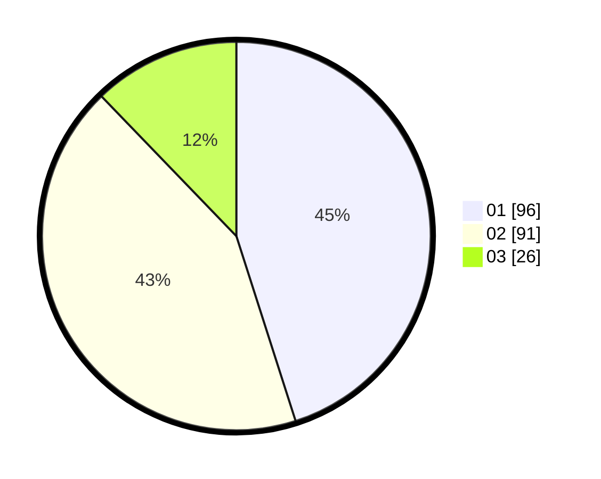

# Hasil

Hasil perolehan suara paslon dapat dilihat pada file paslon-01.txt, paslon-02.txt, dan paslon-03.txt.

Jika tidak ada, artinya data tersebut belum ada pada SIREKAP.

## Perolehan Suara

 * Paslon 01: **96**.
 * Paslon 02: **91**.
 * Paslon 03: **26**.

## Foto C Plano

https://sirekap-obj-formc.kpu.go.id/58ba/pemilu/ppwp/31/71/06/10/05/3171061005011-20240214-220345--cdcb1343-6180-4dc2-b0ca-fe9d281b317a.jpg

https://sirekap-obj-formc.kpu.go.id/58ba/pemilu/ppwp/31/71/06/10/05/3171061005011-20240214-210112--02e99943-fc37-4701-a81c-eeff058a2afb.jpg

https://sirekap-obj-formc.kpu.go.id/58ba/pemilu/ppwp/31/71/06/10/05/3171061005011-20240214-220418--cc2e8f80-1620-417b-b40b-71fc0e91231e.jpg

## DATA PEMILIH TETAP

Jumlah pemilih dalam DPT: **195**.
 * L: **95**.
 * P: **100**.

## DATA PENGGUNA HAK PILIH

Jumlah pengguna hak pilih dalam DPT: **195**.
 * L: **95**.
 * P: **100**.

Jumlah pengguna hak pilih dalam DPTb: **19**.
 * L: **2**.
 * P: **17**.

Jumlah pengguna hak pilih dalam DPK: **1**.
 * L: **1**.
 * P: **0**.

Jumlah pengguna hak pilih: **215**.
 * L: **98**.
 * P: **117**.

## JUMLAH SUARA SAH DAN TIDAK SAH

JUMLAH SELURUH SUARA SAH: **213**.

JUMLAH SUARA TIDAK SAH: **2**.

JUMLAH SELURUH SUARA SAH DAN SUARA TIDAK SAH: **215**.
