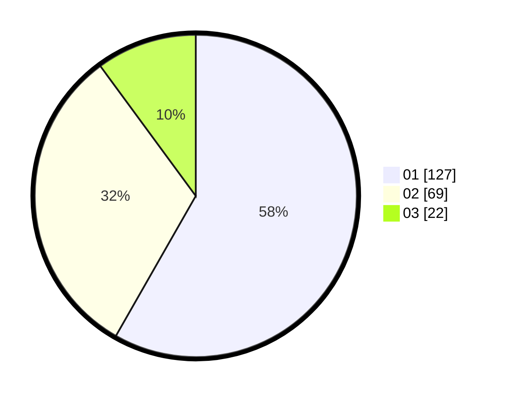

# Hasil

Hasil perolehan suara paslon dapat dilihat pada file paslon-01.txt, paslon-02.txt, dan paslon-03.txt.

Jika tidak ada, artinya data tersebut belum ada pada SIREKAP.

## Perolehan Suara

 * Paslon 01: **127**.
 * Paslon 02: **69**.
 * Paslon 03: **22**.

## Foto C Plano

https://sirekap-obj-formc.kpu.go.id/a932/pemilu/ppwp/31/71/06/10/05/3171061005014-20240215-004059--26d93d5a-f232-4b8f-9d65-7b1c6b7fb6db.jpg

https://sirekap-obj-formc.kpu.go.id/a932/pemilu/ppwp/31/71/06/10/05/3171061005014-20240215-002953--141b49ed-3366-4e74-9a1b-0c8598a7e101.jpg
