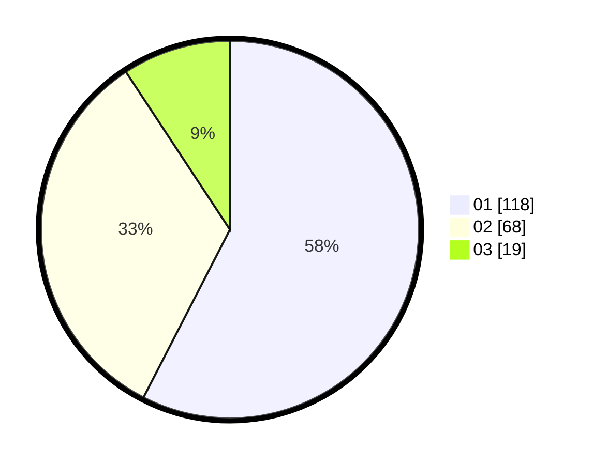

# Hasil

Hasil perolehan suara paslon dapat dilihat pada file paslon-01.txt, paslon-02.txt, dan paslon-03.txt.

Jika tidak ada, artinya data tersebut belum ada pada SIREKAP.

## Perolehan Suara

 * Paslon 01: **118**.
 * Paslon 02: **68**.
 * Paslon 03: **19**.

## Foto C Plano

https://sirekap-obj-formc.kpu.go.id/3e62/pemilu/ppwp/31/71/06/10/05/3171061005015-20240216-190447--58838ae3-1310-4b8c-ade6-2cc174c23ee0.jpg

https://sirekap-obj-formc.kpu.go.id/3e62/pemilu/ppwp/31/71/06/10/05/3171061005015-20240216-190448--6474ad4d-121f-4fb3-9416-fdb7c5b5970d.jpg

https://sirekap-obj-formc.kpu.go.id/3e62/pemilu/ppwp/31/71/06/10/05/3171061005015-20240216-190447--7efbf51f-7216-4765-9c59-7f5d824b6303.jpg

## DATA PEMILIH TETAP

Jumlah pemilih dalam DPT: **271**.
 * L: **141**.
 * P: **130**.

## DATA PENGGUNA HAK PILIH

Jumlah pengguna hak pilih dalam DPT: **192**.
 * L: **98**.
 * P: **94**.

Jumlah pengguna hak pilih dalam DPTb: **12**.
 * L: **6**.
 * P: **6**.

Jumlah pengguna hak pilih dalam DPK: **4**.
 * L: **1**.
 * P: **3**.

Jumlah pengguna hak pilih: **208**.
 * L: **105**.
 * P: **103**.

## JUMLAH SUARA SAH DAN TIDAK SAH

JUMLAH SELURUH SUARA SAH: **205**.

JUMLAH SUARA TIDAK SAH: **3**.

JUMLAH SELURUH SUARA SAH DAN SUARA TIDAK SAH: **208**.
