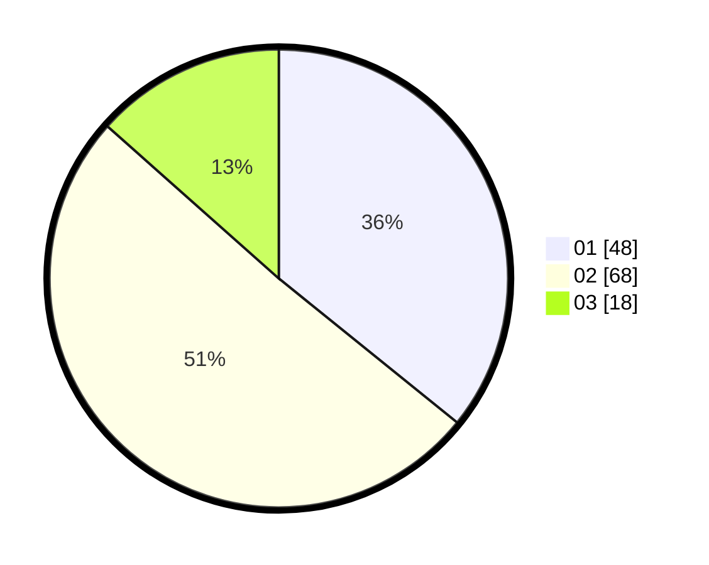

# Hasil

Hasil perolehan suara paslon dapat dilihat pada file paslon-01.txt, paslon-02.txt, dan paslon-03.txt.

Jika tidak ada, artinya data tersebut belum ada pada SIREKAP.

## Perolehan Suara

 * Paslon 01: **48**.
 * Paslon 02: **68**.
 * Paslon 03: **18**.

## Foto C Plano

https://sirekap-obj-formc.kpu.go.id/a536/pemilu/ppwp/31/71/06/10/05/3171061005017-20240216-013634--6a262a2b-a64a-45f3-98de-2728afb08520.jpg

https://sirekap-obj-formc.kpu.go.id/a536/pemilu/ppwp/31/71/06/10/05/3171061005017-20240216-013636--fc492744-4d69-4a63-bc4d-96a1ddf81fbd.jpg

https://sirekap-obj-formc.kpu.go.id/a536/pemilu/ppwp/31/71/06/10/05/3171061005017-20240216-013635--b1c7c771-89ad-4f90-ba04-b7635386e7e4.jpg

## DATA PEMILIH TETAP

Jumlah pemilih dalam DPT: **201**.
 * L: **98**.
 * P: **103**.

## DATA PENGGUNA HAK PILIH

Jumlah pengguna hak pilih dalam DPT: **122**.
 * L: **55**.
 * P: **67**.

Jumlah pengguna hak pilih dalam DPTb: **12**.
 * L: **8**.
 * P: **4**.

Jumlah pengguna hak pilih dalam DPK: **2**.
 * L: **0**.
 * P: **2**.

Jumlah pengguna hak pilih: **136**.
 * L: **63**.
 * P: **73**.

## JUMLAH SUARA SAH DAN TIDAK SAH

JUMLAH SELURUH SUARA SAH: **134**.

JUMLAH SUARA TIDAK SAH: **2**.

JUMLAH SELURUH SUARA SAH DAN SUARA TIDAK SAH: **136**.
