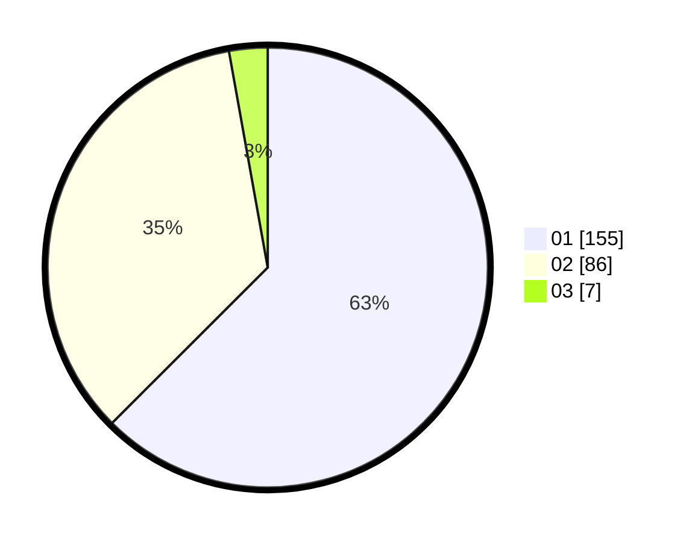

# Hasil

Hasil perolehan suara paslon dapat dilihat pada file paslon-01.txt, paslon-02.txt, dan paslon-03.txt.

Jika tidak ada, artinya data tersebut belum ada pada SIREKAP.

## Perolehan Suara

 * Paslon 01: **155**.
 * Paslon 02: **86**.
 * Paslon 03: **7**.

## Foto C Plano

https://sirekap-obj-formc.kpu.go.id/b6f5/pemilu/ppwp/31/71/06/10/05/3171061005023-20240216-161439--47affed3-ecd5-4756-811b-531fe4b550d1.jpg

https://sirekap-obj-formc.kpu.go.id/b6f5/pemilu/ppwp/31/71/06/10/05/3171061005023-20240216-161440--e65bff96-dadf-4a4d-ba6d-f5e3540d29e0.jpg

https://sirekap-obj-formc.kpu.go.id/b6f5/pemilu/ppwp/31/71/06/10/05/3171061005023-20240216-161439--d54075b9-7159-4cb7-a193-49239cc11062.jpg

## DATA PEMILIH TETAP

Jumlah pemilih dalam DPT: **269**.
 * L: **138**.
 * P: **131**.

## DATA PENGGUNA HAK PILIH

Jumlah pengguna hak pilih dalam DPT: **236**.
 * L: **119**.
 * P: **117**.

Jumlah pengguna hak pilih dalam DPTb: **10**.
 * L: **4**.
 * P: **6**.

Jumlah pengguna hak pilih dalam DPK: **2**.
 * L: **0**.
 * P: **2**.

Jumlah pengguna hak pilih: **248**.
 * L: **123**.
 * P: **125**.

## JUMLAH SUARA SAH DAN TIDAK SAH

JUMLAH SELURUH SUARA SAH: **248**.

JUMLAH SUARA TIDAK SAH: **0**.

JUMLAH SELURUH SUARA SAH DAN SUARA TIDAK SAH: **248**.
