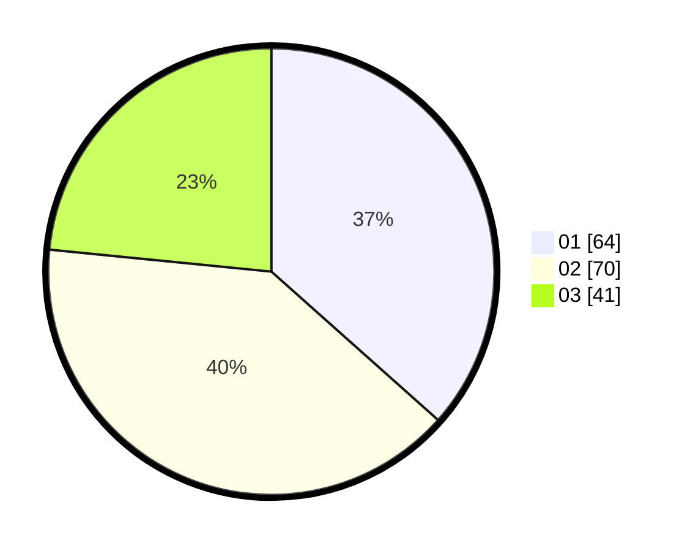

# Hasil

Hasil perolehan suara paslon dapat dilihat pada file paslon-01.txt, paslon-02.txt, dan paslon-03.txt.

Jika tidak ada, artinya data tersebut belum ada pada SIREKAP.

## Perolehan Suara

 * Paslon 01: **64**.
 * Paslon 02: **70**.
 * Paslon 03: **41**.

## Foto C Plano

https://sirekap-obj-formc.kpu.go.id/1a2f/pemilu/ppwp/31/71/06/10/05/3171061005026-20240215-000027--c2449e9d-df87-4dd5-b12d-7de407dd4483.jpg

https://sirekap-obj-formc.kpu.go.id/1a2f/pemilu/ppwp/31/71/06/10/05/3171061005026-20240214-232020--6d1aaf9c-066b-41cf-b0d6-0d10a98c29a6.jpg
