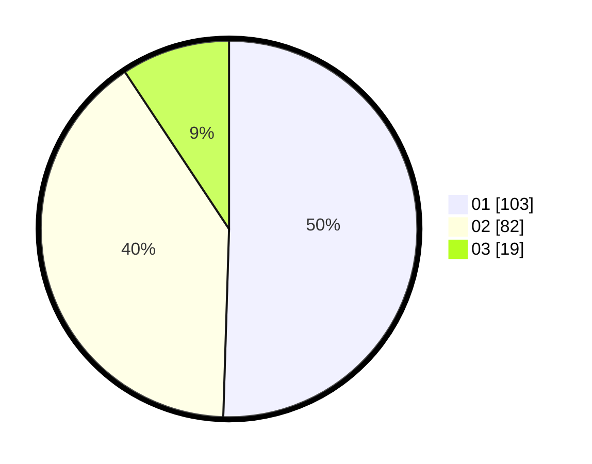

# Hasil

Hasil perolehan suara paslon dapat dilihat pada file paslon-01.txt, paslon-02.txt, dan paslon-03.txt.

Jika tidak ada, artinya data tersebut belum ada pada SIREKAP.

## Perolehan Suara

 * Paslon 01: **103**.
 * Paslon 02: **82**.
 * Paslon 03: **19**.

## Foto C Plano

https://sirekap-obj-formc.kpu.go.id/438e/pemilu/ppwp/31/71/06/10/05/3171061005027-20240217-015059--2cb401cf-eba4-43d7-a836-529d7daa1133.jpg

https://sirekap-obj-formc.kpu.go.id/438e/pemilu/ppwp/31/71/06/10/05/3171061005027-20240217-015101--b94cffb9-f5ec-49ae-a5ab-be652b7d5118.jpg

https://sirekap-obj-formc.kpu.go.id/438e/pemilu/ppwp/31/71/06/10/05/3171061005027-20240217-015100--417296a6-dd1d-495e-a7f5-87307d555a01.jpg

## DATA PEMILIH TETAP

Jumlah pemilih dalam DPT: **209**.
 * L: **100**.
 * P: **109**.

## DATA PENGGUNA HAK PILIH

Jumlah pengguna hak pilih dalam DPT: **193**.
 * L: **93**.
 * P: **100**.

Jumlah pengguna hak pilih dalam DPTb: **3**.
 * L: **1**.
 * P: **2**.

Jumlah pengguna hak pilih dalam DPK: **13**.
 * L: **6**.
 * P: **7**.

Jumlah pengguna hak pilih: **209**.
 * L: **100**.
 * P: **109**.

## JUMLAH SUARA SAH DAN TIDAK SAH

JUMLAH SELURUH SUARA SAH: **204**.

JUMLAH SUARA TIDAK SAH: **5**.

JUMLAH SELURUH SUARA SAH DAN SUARA TIDAK SAH: **209**.
