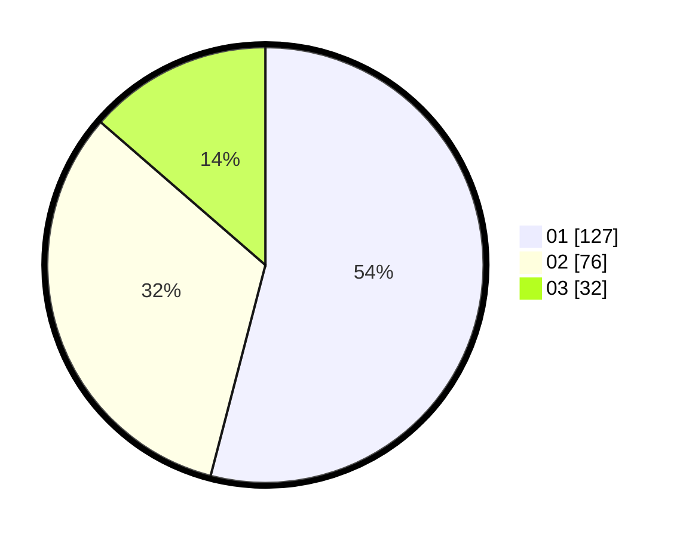

# Hasil

Hasil perolehan suara paslon dapat dilihat pada file paslon-01.txt, paslon-02.txt, dan paslon-03.txt.

Jika tidak ada, artinya data tersebut belum ada pada SIREKAP.

## Perolehan Suara

 * Paslon 01: **127**.
 * Paslon 02: **76**.
 * Paslon 03: **32**.

## Foto C Plano

https://sirekap-obj-formc.kpu.go.id/f729/pemilu/ppwp/31/71/06/10/05/3171061005031-20240217-232709--0762a135-b431-4ad6-ab86-192daeabe1d4.jpg

https://sirekap-obj-formc.kpu.go.id/f729/pemilu/ppwp/31/71/06/10/05/3171061005031-20240217-232545--9d61e0cc-d7d6-4aa1-bd3c-687a2e19f837.jpg

https://sirekap-obj-formc.kpu.go.id/f729/pemilu/ppwp/31/71/06/10/05/3171061005031-20240217-233318--985580dc-e8fd-44c5-90e1-24e24a26c650.jpg

## DATA PEMILIH TETAP

Jumlah pemilih dalam DPT: **279**.
 * L: **151**.
 * P: **128**.

## DATA PENGGUNA HAK PILIH

Jumlah pengguna hak pilih dalam DPT: **211**.
 * L: **112**.
 * P: **99**.

Jumlah pengguna hak pilih dalam DPTb: **22**.
 * L: **10**.
 * P: **12**.

Jumlah pengguna hak pilih dalam DPK: **5**.
 * L: **1**.
 * P: **4**.

Jumlah pengguna hak pilih: **238**.
 * L: **123**.
 * P: **115**.

## JUMLAH SUARA SAH DAN TIDAK SAH

JUMLAH SELURUH SUARA SAH: **235**.

JUMLAH SUARA TIDAK SAH: **3**.

JUMLAH SELURUH SUARA SAH DAN SUARA TIDAK SAH: **238**.
