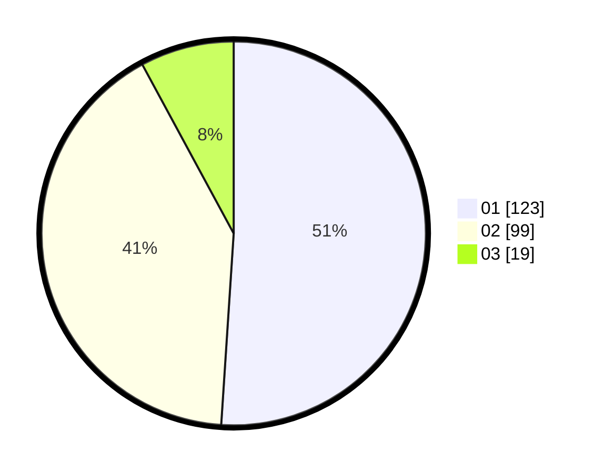

# Hasil

Hasil perolehan suara paslon dapat dilihat pada file paslon-01.txt, paslon-02.txt, dan paslon-03.txt.

Jika tidak ada, artinya data tersebut belum ada pada SIREKAP.

## Perolehan Suara

 * Paslon 01: **123**.
 * Paslon 02: **99**.
 * Paslon 03: **19**.

## Foto C Plano

https://sirekap-obj-formc.kpu.go.id/c254/pemilu/ppwp/31/71/06/10/05/3171061005032-20240216-171817--65d5fbb3-8646-41e8-949b-0ee0ee6ae530.jpg

https://sirekap-obj-formc.kpu.go.id/c254/pemilu/ppwp/31/71/06/10/05/3171061005032-20240216-195804--3873adcb-2c54-486f-b365-0d4a4ae9c96b.jpg

https://sirekap-obj-formc.kpu.go.id/c254/pemilu/ppwp/31/71/06/10/05/3171061005032-20240216-201007--a4cf538c-2214-43c5-8d32-851117f1053f.jpg

## DATA PEMILIH TETAP

Jumlah pemilih dalam DPT: **293**.
 * L: **143**.
 * P: **150**.

## DATA PENGGUNA HAK PILIH

Jumlah pengguna hak pilih dalam DPT: **227**.
 * L: **105**.
 * P: **122**.

Jumlah pengguna hak pilih dalam DPTb: **18**.
 * L: **13**.
 * P: **5**.

Jumlah pengguna hak pilih dalam DPK: **3**.
 * L: **1**.
 * P: **2**.

Jumlah pengguna hak pilih: **248**.
 * L: **119**.
 * P: **129**.

## JUMLAH SUARA SAH DAN TIDAK SAH

JUMLAH SELURUH SUARA SAH: **241**.

JUMLAH SUARA TIDAK SAH: **7**.

JUMLAH SELURUH SUARA SAH DAN SUARA TIDAK SAH: **248**.
