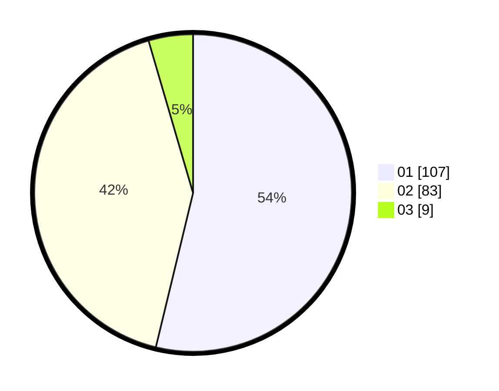

# Hasil

Hasil perolehan suara paslon dapat dilihat pada file paslon-01.txt, paslon-02.txt, dan paslon-03.txt.

Jika tidak ada, artinya data tersebut belum ada pada SIREKAP.

## Perolehan Suara

 * Paslon 01: **107**.
 * Paslon 02: **83**.
 * Paslon 03: **9**.

## Foto C Plano

https://sirekap-obj-formc.kpu.go.id/4a31/pemilu/ppwp/31/71/06/10/05/3171061005034-20240216-181550--2333ac7b-e2ec-40ac-8e80-e77e6971e554.jpg

https://sirekap-obj-formc.kpu.go.id/4a31/pemilu/ppwp/31/71/06/10/05/3171061005034-20240216-161432--f9ba5795-990c-42af-b862-cb6d295d1225.jpg

https://sirekap-obj-formc.kpu.go.id/4a31/pemilu/ppwp/31/71/06/10/05/3171061005034-20240216-161431--f66c37ea-c1ba-4c72-a038-034aad53a9d6.jpg

## DATA PEMILIH TETAP

Jumlah pemilih dalam DPT: **276**.
 * L: **139**.
 * P: **137**.

## DATA PENGGUNA HAK PILIH

Jumlah pengguna hak pilih dalam DPT: **175**.
 * L: **89**.
 * P: **86**.

Jumlah pengguna hak pilih dalam DPTb: **17**.
 * L: **4**.
 * P: **13**.

Jumlah pengguna hak pilih dalam DPK: **0**.
 * L: **0**.
 * P: **0**.

Jumlah pengguna hak pilih: **192**.
 * L: **93**.
 * P: **99**.

## JUMLAH SUARA SAH DAN TIDAK SAH

JUMLAH SELURUH SUARA SAH: **199**.

JUMLAH SUARA TIDAK SAH: **5**.

JUMLAH SELURUH SUARA SAH DAN SUARA TIDAK SAH: **204**.
