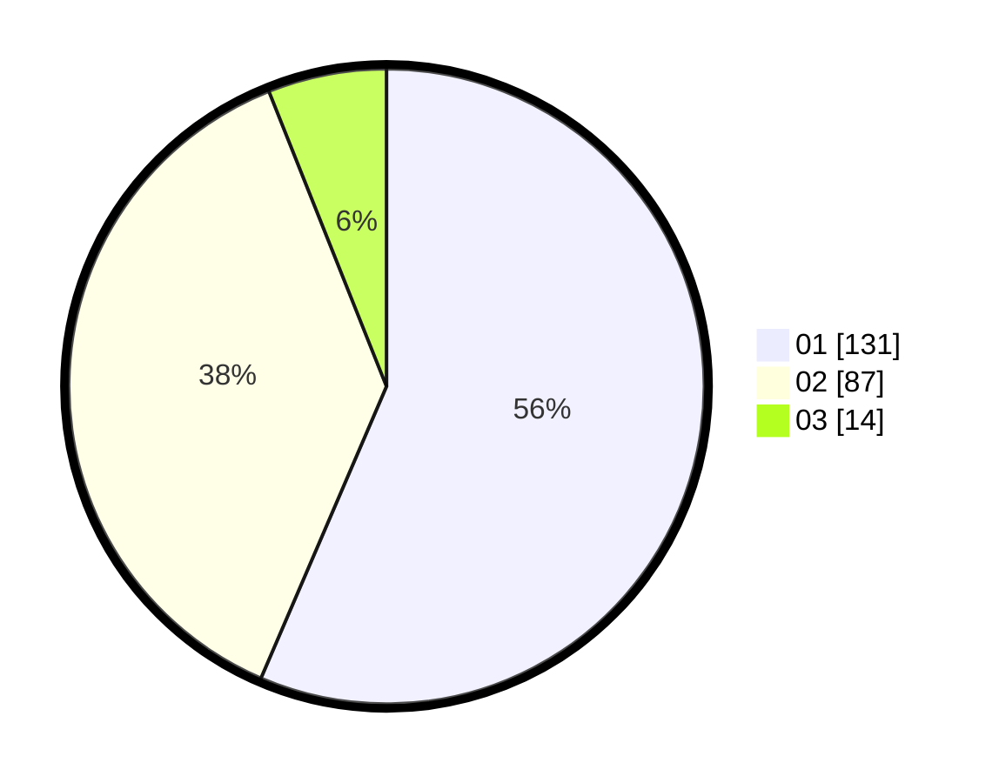

# Hasil

Hasil perolehan suara paslon dapat dilihat pada file paslon-01.txt, paslon-02.txt, dan paslon-03.txt.

Jika tidak ada, artinya data tersebut belum ada pada SIREKAP.

## Perolehan Suara

 * Paslon 01: **131**.
 * Paslon 02: **87**.
 * Paslon 03: **14**.

## Foto C Plano

https://sirekap-obj-formc.kpu.go.id/f208/pemilu/ppwp/31/71/06/10/05/3171061005036-20240215-013214--01c32bc0-b8f8-4f4a-8692-dbb6b2454bce.jpg

https://sirekap-obj-formc.kpu.go.id/f208/pemilu/ppwp/31/71/06/10/05/3171061005036-20240215-013335--fe8fe09c-e4ae-4566-9153-645d4ba80abf.jpg

https://sirekap-obj-formc.kpu.go.id/f208/pemilu/ppwp/31/71/06/10/05/3171061005036-20240215-013500--4f124e4f-b3ff-48d0-b5d9-f55bc3e60cbb.jpg

## DATA PEMILIH TETAP

Jumlah pemilih dalam DPT: **278**.
 * L: **148**.
 * P: **130**.

## DATA PENGGUNA HAK PILIH

Jumlah pengguna hak pilih dalam DPT: **219**.
 * L: **117**.
 * P: **102**.

Jumlah pengguna hak pilih dalam DPTb: **17**.
 * L: **9**.
 * P: **8**.

Jumlah pengguna hak pilih dalam DPK: **0**.
 * L: **0**.
 * P: **0**.

Jumlah pengguna hak pilih: **236**.
 * L: **126**.
 * P: **110**.

## JUMLAH SUARA SAH DAN TIDAK SAH

JUMLAH SELURUH SUARA SAH: **232**.

JUMLAH SUARA TIDAK SAH: **4**.

JUMLAH SELURUH SUARA SAH DAN SUARA TIDAK SAH: **236**.
