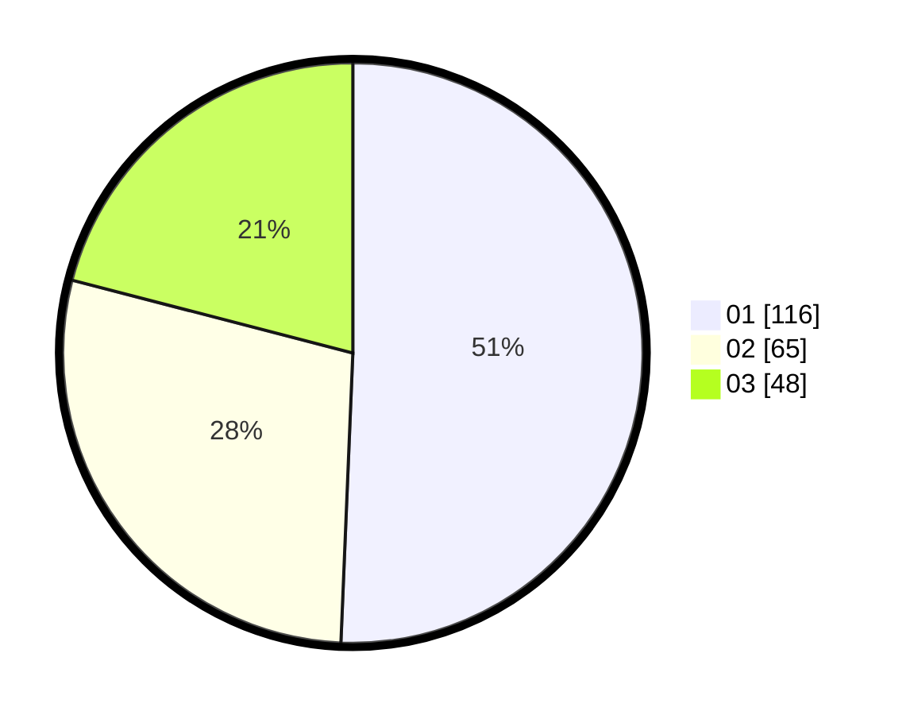

# Hasil

Hasil perolehan suara paslon dapat dilihat pada file paslon-01.txt, paslon-02.txt, dan paslon-03.txt.

Jika tidak ada, artinya data tersebut belum ada pada SIREKAP.

## Perolehan Suara

 * Paslon 01: **116**.
 * Paslon 02: **65**.
 * Paslon 03: **48**.

## Foto C Plano

https://sirekap-obj-formc.kpu.go.id/6c87/pemilu/ppwp/31/71/06/10/05/3171061005041-20240214-195550--806a523a-52a4-4478-96d4-e471295cec43.jpg

https://sirekap-obj-formc.kpu.go.id/6c87/pemilu/ppwp/31/71/06/10/05/3171061005041-20240214-195450--168c6ab6-c54e-45e4-accd-15a211d537fd.jpg

https://sirekap-obj-formc.kpu.go.id/6c87/pemilu/ppwp/31/71/06/10/05/3171061005041-20240214-195647--09f45a9a-339e-4ef3-ae12-37aec57a0074.jpg

## DATA PEMILIH TETAP

Jumlah pemilih dalam DPT: **276**.
 * L: **136**.
 * P: **140**.

## DATA PENGGUNA HAK PILIH

Jumlah pengguna hak pilih dalam DPT: **217**.
 * L: **102**.
 * P: **115**.

Jumlah pengguna hak pilih dalam DPTb: **17**.
 * L: **7**.
 * P: **10**.

Jumlah pengguna hak pilih dalam DPK: **0**.
 * L: **0**.
 * P: **0**.

Jumlah pengguna hak pilih: **234**.
 * L: **109**.
 * P: **124**.

## JUMLAH SUARA SAH DAN TIDAK SAH

JUMLAH SELURUH SUARA SAH: **229**.

JUMLAH SUARA TIDAK SAH: **5**.

JUMLAH SELURUH SUARA SAH DAN SUARA TIDAK SAH: **234**.
