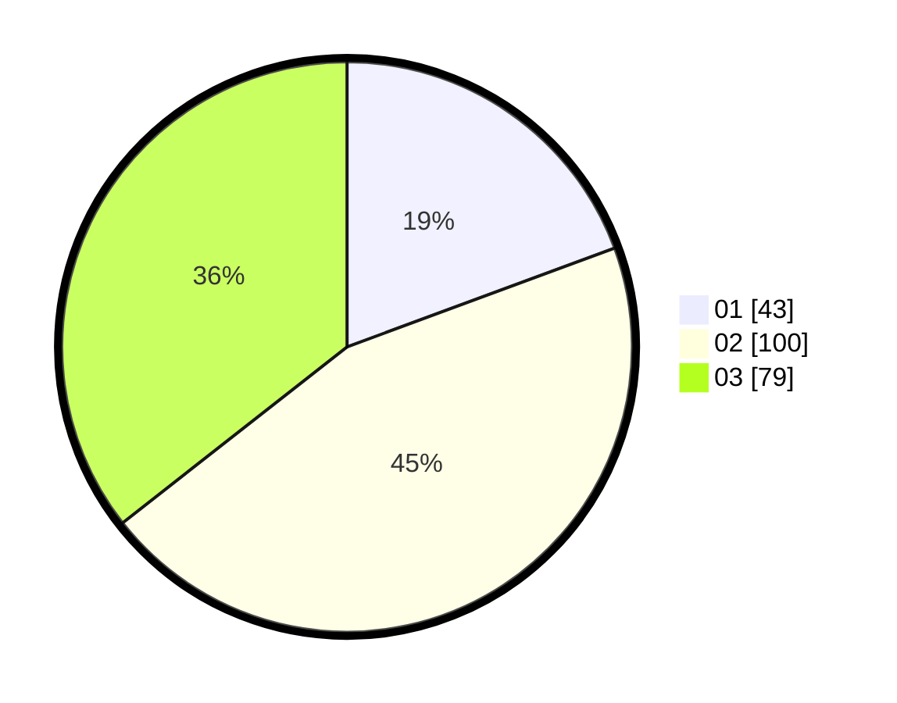

# Hasil

Hasil perolehan suara paslon dapat dilihat pada file paslon-01.txt, paslon-02.txt, dan paslon-03.txt.

Jika tidak ada, artinya data tersebut belum ada pada SIREKAP.

## Perolehan Suara

 * Paslon 01: **43**.
 * Paslon 02: **100**.
 * Paslon 03: **79**.

## Foto C Plano

https://sirekap-obj-formc.kpu.go.id/8c9c/pemilu/ppwp/31/71/07/10/01/3171071001001-20240214-212126--d5f67cba-1440-413a-849b-fa2b867dc206.jpg

https://sirekap-obj-formc.kpu.go.id/8c9c/pemilu/ppwp/31/71/07/10/01/3171071001001-20240214-212451--7cbd5d78-4190-4245-830e-40f6b6d6fc50.jpg

https://sirekap-obj-formc.kpu.go.id/8c9c/pemilu/ppwp/31/71/07/10/01/3171071001001-20240214-212556--a5b85e9d-4afc-4f24-aee1-362f3fa32145.jpg

## DATA PEMILIH TETAP

Jumlah pemilih dalam DPT: **267**.
 * L: **120**.
 * P: **147**.

## DATA PENGGUNA HAK PILIH

Jumlah pengguna hak pilih dalam DPT: **200**.
 * L: **87**.
 * P: **113**.

Jumlah pengguna hak pilih dalam DPTb: **23**.
 * L: **9**.
 * P: **14**.

Jumlah pengguna hak pilih dalam DPK: **5**.
 * L: **3**.
 * P: **2**.

Jumlah pengguna hak pilih: **228**.
 * L: **99**.
 * P: **129**.

## JUMLAH SUARA SAH DAN TIDAK SAH

JUMLAH SELURUH SUARA SAH: **222**.

JUMLAH SUARA TIDAK SAH: **6**.

JUMLAH SELURUH SUARA SAH DAN SUARA TIDAK SAH: **228**.
