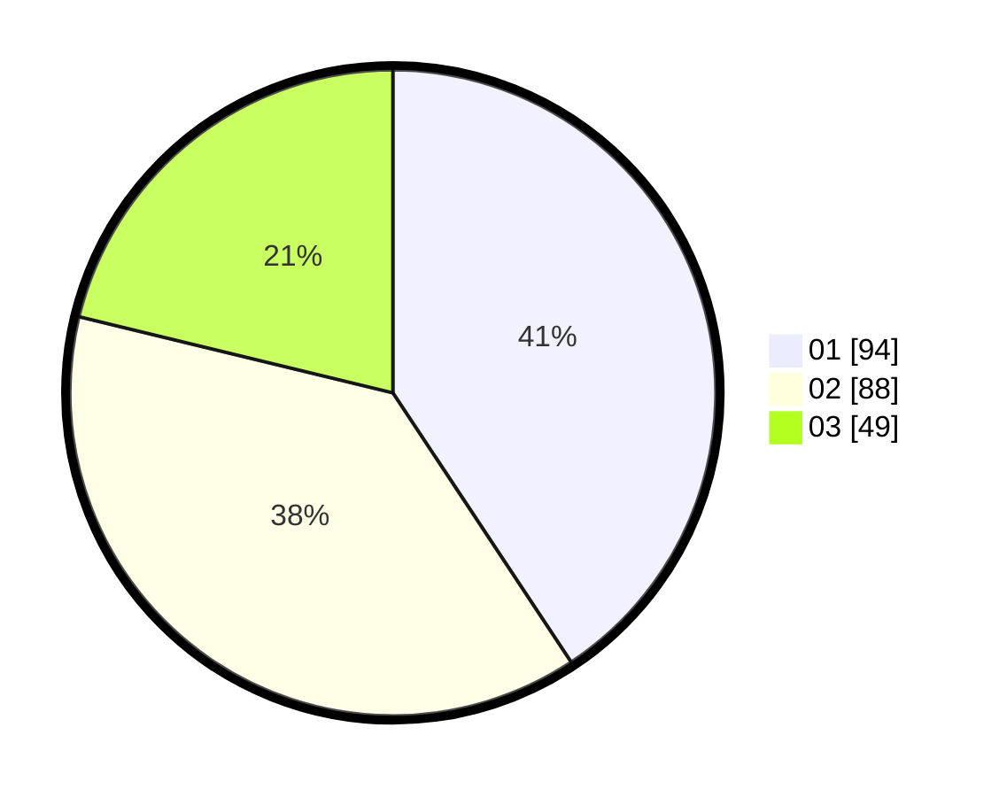

# Hasil

Hasil perolehan suara paslon dapat dilihat pada file paslon-01.txt, paslon-02.txt, dan paslon-03.txt.

Jika tidak ada, artinya data tersebut belum ada pada SIREKAP.

## Perolehan Suara

 * Paslon 01: **94**.
 * Paslon 02: **88**.
 * Paslon 03: **49**.

## Foto C Plano

https://sirekap-obj-formc.kpu.go.id/47cb/pemilu/ppwp/31/71/07/10/01/3171071001002-20240216-221739--cc9d754d-2168-4e5e-90c9-f49877c2bef5.jpg

https://sirekap-obj-formc.kpu.go.id/47cb/pemilu/ppwp/31/71/07/10/01/3171071001002-20240216-221740--dd5ece80-1874-4730-b9c8-8399e405fd17.jpg

https://sirekap-obj-formc.kpu.go.id/47cb/pemilu/ppwp/31/71/07/10/01/3171071001002-20240216-221740--b890e22b-f9f8-479a-8b7d-62e89c8bdaf8.jpg

## DATA PEMILIH TETAP

Jumlah pemilih dalam DPT: **279**.
 * L: **146**.
 * P: **133**.

## DATA PENGGUNA HAK PILIH

Jumlah pengguna hak pilih dalam DPT: **169**.
 * L: **90**.
 * P: **79**.

Jumlah pengguna hak pilih dalam DPTb: **21**.
 * L: **3**.
 * P: **18**.

Jumlah pengguna hak pilih dalam DPK: **4**.
 * L: **2**.
 * P: **2**.

Jumlah pengguna hak pilih: **194**.
 * L: **95**.
 * P: **99**.

## JUMLAH SUARA SAH DAN TIDAK SAH

JUMLAH SELURUH SUARA SAH: **191**.

JUMLAH SUARA TIDAK SAH: **3**.

JUMLAH SELURUH SUARA SAH DAN SUARA TIDAK SAH: **194**.
